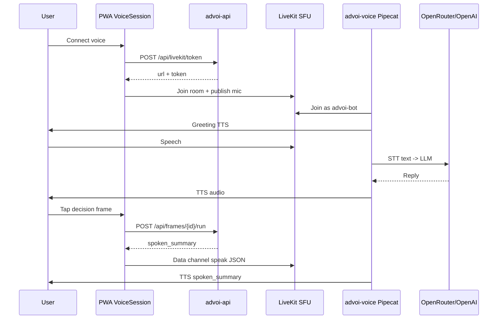
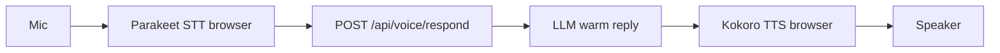

# Voice paths

ADVoi supports one **production** voice path today and a **partially landed** client-side path for privacy and latency.

## Path A: Server voice (LiveKit + Pipecat) — built

This is the primary staging path.

### Components

| Piece | File / service |
|-------|----------------|
| PWA connect + frames | `web/components/VoiceSession.tsx` |
| Home open briefs + review queue | `web/components/PwaHomeBriefsSurface.tsx` + pure model `pwaBriefsSurface.ts` (thin `GET /api/briefs` / `GET /api/review-queue`; not voice-critical) |
| Home install + morning pulse CTA | `web/components/PwaHomeOnboarding.tsx` |
| Token minting | `advoi/voice/tokens.py`, `advoi/api/app.py` |
| Voice worker | `advoi/voice/agent.py` |
| Frame → TTS | `advoi/voice/frame_dispatch.py` |
| Memory on turn | `advoi/voice/memory_hooks.py` |
| LiveKit config | `deploy/livekit.yaml`, `advoi/voice/livekit_env.py` |

### Requirements

- `OPENAI_API_KEY` or `OPENROUTER_API_KEY` in `deploy/.env` (voice container **crash-loops** without this)
- `LIVEKIT_*` keys (dev keys in staging example)
- `advoi-voice` + `livekit` containers healthy
- User must call `room.startAudio()` (implemented in PWA) for remote TTS to play

### Known failure mode

PWA shows **connected** (green) but **no audio** when `advoi-voice` is down. Frame API still returns text; TTS path is broken.

---

## Path B: Client voice (Kokoro + Parakeet) — partially landed

Scaffold is in the repo; staging E2E and device WebGPU validation are still open.

### Shipped stack

| Piece | Location |
|-------|----------|
| COOP/COEP headers | `web/next.config.ts` |
| Client voice module | `web/voice-interface/` — `VoiceTTS`, `VoiceSTT`, `VoiceLoop` |
| Local route | `web/app/voice-local/page.tsx` → `/voice-local` |
| Warm reply API | `POST /api/voice/respond` in `advoi/api/app.py` |
| LLM helper | `advoi/voice/respond.py` |
| Browser deps | `kokoro-js`, `parakeet.js`, `onnxruntime-web` in `web/package.json` |

### Still missing for Path B parity

- Intent classifier: utterance → frame auto-route (frame `voice_prompt` catalog only)
- Staging sign-off with on-device model download and WebGPU (especially iOS)
- Production reverse-proxy path for `/voice-local` (dev rewrite only today)

### Why two paths

| Concern | Server path | Client path |
|---------|-------------|-------------|
| Latency | Network + cloud STT/TTS | On-device inference |
| Privacy | Audio to cloud | Local STT/TTS |
| Cost | Per-minute API | Model download once |
| Portfolio integration | Full Pipecat + memory | Lighter; frames via HTTP |

**Recommendation:** Keep Path A for staging E2E sign-off; use Path B locally at `/voice-local` while validating browser inference.

---

## Copy and tone

Voice and UI avoid em dashes in user-facing strings.

- Frame labels in `advoi/decision/frames.py` use colon format (`Option A: Fleet status`).
- `advoi/copy_style.py` (`plain_copy`) normalizes spoken summaries and LLM replies.
- Client `VoiceLoop` uses `stripEmDash` before TTS.

Warm delivery guidelines live in `advoi/voice/prompts.py` (`ADVoi_BASE_INSTRUCTION`).