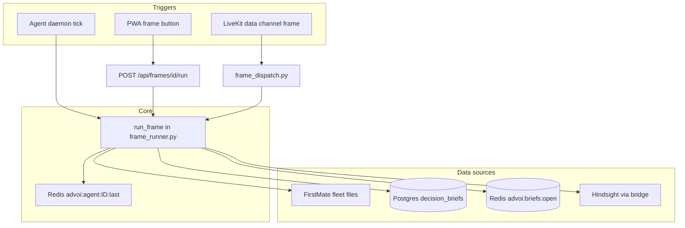

# Multi-agent architecture

Stage 1.5 adds **three specialist agents**, each bound to one **decision frame**. They run as background daemons and cache results for fast PWA/voice responses.

## Agents and frames

| Agent ID | Name | Frame ID | PWA label | Confirmation |
|----------|------|----------|-----------|--------------|
| `fleet-scout` | Fleet Scout | `fleet_status` | Option A — Fleet status | No |
| `brief-curator` | Brief Curator | `open_briefs` | Option B — Open briefs | No |
| `review-queue` | Review Queue | `queue_deep_review` | Option C — Queue deep review | Yes |

Source: `advoi/routing/agents.py`, `advoi/decision/frames.py`

## Execution flow



## Frame runner behavior

`advoi/routing/frame_runner.py`:

- **Fleet Scout** — Reads fleet snapshot from `FIRSTMATE_FLEET_PATH` (file-based). Mock mode via `ADVOI_FRAME_MOCK=true`.
- **Brief Curator** — Postgres `decision_briefs`, Redis `advoi:briefs:open`, Hindsight recall. Mock mode available.
- **Review Queue** — Confirmation gate; queues stub (no desktop brief URL yet).

Cache: Redis key `advoi:agent:{agent_id}:last`, TTL `2 * ADVOI_AGENT_INTERVAL_SECS`.

## Daemon deployment

### Docker (production / staging)

Three compose services, same image as API:

```yaml
advoi-agent-fleet   → python -m advoi.routing.agent_daemon fleet-scout
advoi-agent-briefs  → python -m advoi.routing.agent_daemon brief-curator
advoi-agent-review  → python -m advoi.routing.agent_daemon review-queue
```

Default interval: `ADVOI_AGENT_INTERVAL_SECS=45` in `deploy/.env.staging.example`.

### Local supervisor (development)

Single process runs all three:

```bash
uv run python -m advoi.routing.agent_supervisor
```

File: `advoi/routing/agent_supervisor.py`

## API integration

- `GET /api/agents` — Lists agents; includes `last_run` when Redis is reachable.
- `POST /api/frames/{frame_id}/run` — On-demand execution (bypasses cache when `refresh=true`).
- PWA `VoiceSession.tsx` — Calls frame API, publishes `{type:"speak", text}` on LiveKit data channel.

## What is not built

| Capability | Status |
|------------|--------|
| Intent routing (speech → frame) | Not built |
| Agent-to-agent handoff | Not built |
| Squad execution after review queue | Stub only |
| Per-user agent personalization | Not built |
| Agent health metrics / alerting | Logs only |

## Testing

| Script | Purpose |
|--------|---------|
| `scripts/agents-smoke-test.ps1` | Windows: all frames + agent registry |
| `scripts/agents-smoke-test.sh` | Bash: same (use from host that reaches API) |
| `scripts/voice-smoke-test.sh` | Full voice journey against public URL |
| `tests/test_frames.py` | Unit tests with mock frames |
| `tests/test_agent_supervisor.py` | Supervisor covers all 3 agents |