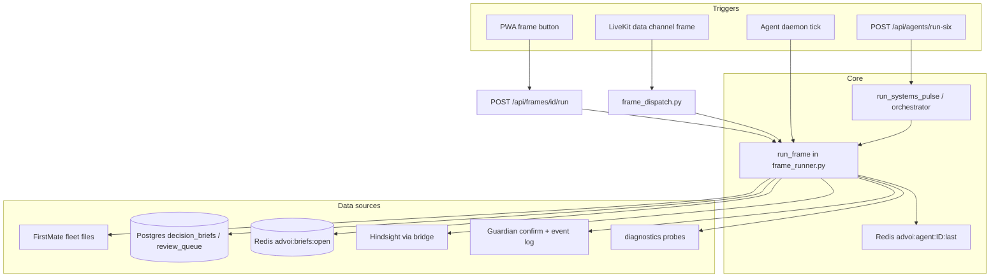

# Multi-agent architecture

Runtime ships **six specialist agents**, each bound to one **decision frame** (PWA Options A–F). They run as background daemons and cache results for fast PWA/voice responses. Parallel refresh is available via `POST /api/agents/run-six`.

> **Doc sync:** Reconciled with `advoi/routing/agents.py` + `advoi/decision/frames.py` (6 agents / 6 frames). Companion review: [ARCHITECTURE-DATA-MEMORY-REVIEW.md](../reviews/ARCHITECTURE-DATA-MEMORY-REVIEW.md) (closes *Routing/Decision **Stale***; unblocks M9.4 / GAP-012).

## Agents and frames

| Option | Agent ID | Name | Frame ID | Role | Confirmation |
|--------|----------|------|----------|------|--------------|
| A | `fleet-scout` | Fleet Scout | `fleet_status` | Read-only FirstMate / Hermes fleet status | No |
| B | `brief-curator` | Brief Curator | `open_briefs` | Surface open decision briefs from memory and backlog | No |
| C | `review-queue` | Review Queue | `queue_deep_review` | Queue async deep review for desktop follow-up (not live execution) | **Yes** (Guardian) |
| D | `systems-pulse` | Systems Pulse | `systems_pulse` | Orchestrate fleet, briefs, and agent cache in one parallel pass | No |
| E | `memory-scout` | Memory Scout | `memory_health` | Probe Hindsight bridge, Redis, Postgres, and operational store health | No |
| F | `guardian-sentinel` | Guardian Sentinel | `guardian_status` | Surface confirmation policy and recent guardian events | No |

| Frame ID | PWA / catalog label | Voice prompt |
|----------|---------------------|--------------|
| `fleet_status` | Option A: Fleet status | Give me a quick fleet status update. |
| `open_briefs` | Option B: Open briefs | What decision briefs are open right now? |
| `queue_deep_review` | Option C: Queue deep review | Queue a deep review for the top priority item. |
| `systems_pulse` | Option D: Systems pulse | Give me a full systems pulse across fleet and briefs. |
| `memory_health` | Option E: Memory health | How is the memory stack doing? |
| `guardian_status` | Option F: Guardian status | What is the guardian and safety status? |

Source of truth: `advoi/routing/agents.py` (`AGENTS`), `advoi/decision/frames.py` (`FRAMES`). Staging: `GET /api/agents` reports `ready: 6`, `total: 6`.

## Execution flow



## Frame runner behavior

`advoi/routing/frame_runner.py` dispatches all six frames (plus diagnostic helpers):

| Frame | Backend | Behavior |
|-------|---------|----------|
| `fleet_status` | Fleet Scout | Reads fleet snapshot from `FIRSTMATE_FLEET_PATH` (profile, backlog, state, Aether gate). Mock via `ADVOI_FRAME_MOCK=true`. |
| `open_briefs` | Brief Curator | Postgres `decision_briefs`, Redis `advoi:briefs:open`, Hindsight recall fallback. Mock mode available. |
| `queue_deep_review` | Review Queue | **Built** — Guardian `evaluate_frame_confirmation`; on confirm, `enqueue_review` → Postgres `review_queue` + desktop brief URL (`ADVOI_DESKTOP_BRIEF_BASE_URL`). Not a stub. |
| `systems_pulse` | Systems Pulse | `advoi/routing/orchestrator.py` — parallel specialist pass; post-frame Aether enrich via `post_frame_aether`. |
| `memory_health` | Memory Scout | `advoi/routing/diagnostic_frames.run_memory_health` — bridge, Redis, Postgres, operational store probes. |
| `guardian_status` | Guardian Sentinel | `run_guardian_status` — confirmation policy, high-risk frames/actions, recent guardian event log tail. |

Cache: Redis key `advoi:agent:{agent_id}:last`, TTL `2 * ADVOI_AGENT_INTERVAL_SECS`. Cache bypassed when `refresh=true` or `confirmed=true`.

### Review queue (built, not stub)

1. Frame requires confirmation (`requires_confirmation=True` on Option C).
2. Guardian confirmation gate (`advoi/guardian/confirmation.py`) blocks until voice confirm or double-tap.
3. On proceed: `advoi/memory/review_queue.enqueue_review` persists to Postgres and returns a desktop brief URL.
4. Mock mode still returns a synthetic queue id + URL without DB.

## Daemon deployment

### Docker (production / staging)

Six compose services, same image as API (`docker-compose.yml`, profile `app`):

```yaml
advoi-agent-fleet     → python -m advoi.routing.agent_daemon fleet-scout
advoi-agent-briefs    → python -m advoi.routing.agent_daemon brief-curator
advoi-agent-review    → python -m advoi.routing.agent_daemon review-queue
advoi-agent-systems   → python -m advoi.routing.agent_daemon systems-pulse
advoi-agent-memory    → python -m advoi.routing.agent_daemon memory-scout
advoi-agent-guardian  → python -m advoi.routing.agent_daemon guardian-sentinel
```

Default interval: `ADVOI_AGENT_INTERVAL_SECS=45` in `deploy/.env.staging.example`.

### Local supervisor (development)

Single process runs all six (`DEFAULT_AGENT_IDS = tuple(AGENTS.keys())`):

```bash
uv run python -m advoi.routing.agent_supervisor
```

File: `advoi/routing/agent_supervisor.py`

### Run-six (API / platform)

- `POST /api/agents/run-six?refresh=true` — parallel refresh of all specialists.
- Optional `dispatch_squads=true` — platform path via `advoi/squads/orchestrate.run_six_with_platform`.
- Voice capabilities expose `run_six` / squads dispatch as operator actions.

## API integration

- `GET /api/agents` — Lists 6 agents; includes `last_run` when Redis is reachable; `ready` / `total` / `all_ready`.
- `GET /api/frames` — Lists 6 decision frames (A–F).
- `POST /api/frames/{frame_id}/run` — On-demand execution (bypasses cache when `refresh=true`).
- `POST /api/agents/run-six` — Parallel multi-agent refresh.
- PWA `VoiceSession.tsx` — Calls frame API, publishes `{type:"speak", text}` on LiveKit data channel.

## What is not built

| Capability | Status |
|------------|--------|
| Full free-speech NLU → frame | Keyword / intent routing only |
| Agent-to-agent handoff protocol | Not built (systems-pulse orchestrates in-process) |
| Per-user agent personalization | Not built |
| Agent health metrics / alerting | Logs + guardian events; no full alerting product |
| Ontology-generated agent/frame manifests | Deferred (`advoi-ontology-registry-01`) |

## Testing

| Script / test | Purpose |
|---------------|---------|
| `scripts/agents-smoke-test.ps1` | Windows: all frames + agent registry |
| `scripts/agents-smoke-test.sh` | Bash: same (host that reaches API) |
| `scripts/voice-smoke-test.sh` | Full voice journey against public URL |
| `tests/test_frames.py` | Unit tests with mock frames |
| `tests/test_agent_supervisor.py` | Supervisor covers **all 6** agents (`len(DEFAULT_AGENT_IDS) == 6`) |
| `tests/test_run_all_agents.py` | `run-six` API alias + parallel refresh |
