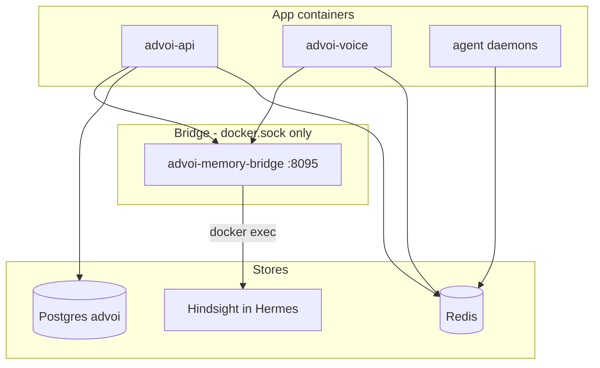

# Memory and data

ADVoi uses a **hybrid memory model** (ADR-026). Strategic recall goes through Hermes Hindsight; canonical state lives in Postgres; ephemeral session data in Redis.

Full operator guide: [../MEMORY-STACK.md](../MEMORY-STACK.md)

## Tier diagram

## Write targets

`advoi/memory/write_targets.py` routes events to explicit targets (no double-write):

| Event type | Primary store |
|------------|---------------|
| `portfolio_fact` | Hindsight |
| `user_preference` | Letta (when enabled) |
| `voice_turn` | Redis rolling window |
| `runtime_error` | Guardian log (not beliefs) |

## Brief Curator data paths

Single read order (ADR-026 ship #2b — no triple-merge):

1. **Canonical** — Postgres `decision_briefs` via `postgres_store.py`
2. **Cache fill** — Redis `advoi:briefs:open` filled from PG on read; **invalidate-on-write** after `upsert_open_brief`
3. **Optional enrich** — Hindsight recall only when PG (and degraded cache) are empty — not merged with PG/Redis titles

`EVENT_WRITE_MAP[decision_brief] = (postgres,)` only. Seed scripts write PG first; Redis is a cache mirror; Hindsight seed uses `portfolio_fact` for optional strategic enrich.

**PWA thin read:** `GET /api/briefs` reuses `_load_open_briefs` (PG → Redis cache-only) for home cards — **no Hindsight enrich, no frame run, no PEL**. Voice frame `open_briefs` may still Hindsight-enrich when that load is empty. Home UI: `PwaHomeBriefsSurface` on `/` (see AGENTS.md / manual A17).

Seed script: `scripts/seed-advoi-briefs.sh` (Postgres + Redis cache + optional Hermes enrich).

Local seed without Hermes: `scripts/seed-local-briefs.py`

## Voice session memory

- **Recall** at bot join — `MemoryRouter.recall()` in `agent.py`
- **Retain** after turns — `VoiceMemoryProcessor` in pipeline (`memory_hooks.py`)
- Session id default: `voice-main`

## Fleet data

Fleet Scout reads **read-only** files under `FIRSTMATE_FLEET_PATH` (default `/opt/firstmate-fleet`). No write access to fleet config.

## Portfolio Event Log (PEL)

Moat R1 append-only control-plane log: Postgres **`portfolio_events`** via `advoi.analytics.pel.append_event` (enums `EventSource` / `EventType`).

| Emit point | `source` | `type` |
|------------|----------|--------|
| `run_frame` completion | `api` | `frame_run` |
| `invoke_fleet_trigger` | `fleet` | `fleet_trigger` |
| Fleet confirmation gate | `fleet` | `guardian_gate` |
| Voice frame / operator intent | `voice` | `voice_intent` |

- Schema: [07-portfolio-event-log.md](07-portfolio-event-log.md) · migration `deploy/migrations/001_portfolio_events.sql`
- Plan: [migration-plan.md](../../data/feedback-evidence/advoi-data-memory-events-pel-01/migration-plan.md)
- T0: `tests/test_portfolio_events.py` · T2: ROADMAP M10.4
- **`memory_events` not removed** — still used by `retain_structured` until cutover; deprecation checklist in migration plan

## Gaps

| Gap | Impact |
|-----|--------|
| Letta disabled (`LETTA_ENABLED=false`) | No operational/identity memory |
| Bridge fails if Hermes down | Recall/retain degrades; briefs may still work from Redis/Postgres |
| No memory compaction / TTL policy for Postgres events | Long-term growth unmanaged |
| Hindsight indexing delay after seed | Brief curator may return empty briefly after seed |
| `memory_events` vs planned PEL dual authority | Unclear event system of record — see PEL design; implement in `advoi-analytics-pel-schema-01` |