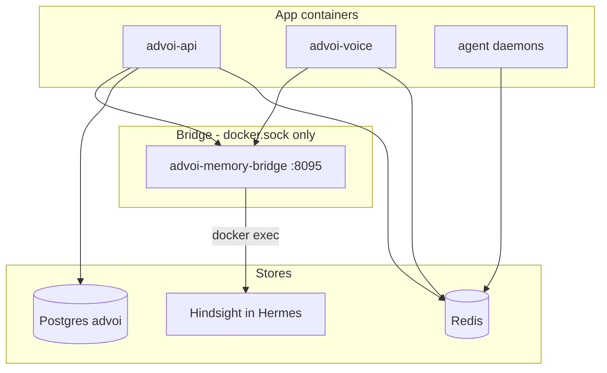

# Memory and data

ADVoi uses a **hybrid memory model** (ADR-026). Strategic recall goes through Hermes Hindsight; canonical state lives in Postgres; ephemeral session data in Redis.

Full operator guide: [../MEMORY-STACK.md](../MEMORY-STACK.md)

Source for this matrix: [ARCHITECTURE-DATA-MEMORY-REVIEW § Data architecture](../reviews/ARCHITECTURE-DATA-MEMORY-REVIEW.md) (stores and authority). PEL detail: [07-portfolio-event-log.md](07-portfolio-event-log.md).

## Data authority matrix

**Rule:** each entity has **one canonical store**. Caches and mirrors may lag; when they disagree, **canonical wins**. Do not invent a second writer for the same concern.

### Entity → canonical source

| Entity / concern | Canonical store | Secondary / cache | Never authoritative in | Notes |
|------------------|-----------------|-------------------|------------------------|-------|
| Open decision briefs | **Postgres** `decision_briefs` | Redis `advoi:briefs:open` (cache fill + invalidate-on-write) | Hindsight titles, Redis alone | `EVENT_WRITE_MAP[decision_brief] = (postgres,)`. Hindsight may enrich only when PG empty. |
| Deep review queue items | **Postgres** `review_queue` | Desktop brief URL / mock `/briefs/{id}` | Redis agent cache | Created via review frame + Guardian confirm; table ensured in `review_queue.py`. |
| Control-plane / executive events | **Postgres** `portfolio_events` (PEL) | — | Hindsight (no per-event dual-write) | Append-only via `advoi.analytics.pel.append_event`. Moat R1. |
| Structured memory retain mirror | Postgres `memory_events` (**legacy**) | — | PEL until cutover complete | Written by `retain_structured`; **not** the long-term SoR — migrate → PEL then deprecate. |
| Strategic beliefs / portfolio facts | **Hindsight** (Hermes via memory-bridge) | Optional Postgres mirror for structured fields on some event types | Redis turns, fleet backlog text | Primary for `portfolio_fact`, governance, synthesis. |
| User prefs / agent identity / squad ops | **Letta** when `LETTA_ENABLED` | JSONL `operational_store` fallback | Fleet backlog, Hindsight (squad chatter) | Off on staging by default (`LETTA_ENABLED=false`). |
| Voice turn window | **Redis** `advoi:ephemeral:{session}` | — | Postgres, Hindsight, PEL | Max **5** turns (`MAX_TURNS`); TTL **3600s**. Session default `voice-main`. |
| Rolling session summary | **Redis** | — | Postgres briefs | `rolling_summary` write target only. |
| Agent last_run cache | **Redis** `advoi:agent:{id}:last` | — | Postgres | TTL = `2 ×` daemon interval; PWA/`/api/agents` fast path only. |
| Runtime failures / recovery notes | **Guardian JSONL** (`guardian_log.py`) | Structured `guardian_gate` rows in PEL when gated | Letta, Hindsight (failures ≠ beliefs) | Path: `docs/error-log/guardian-events.jsonl` (or `GUARDIAN_LOG_PATH`). |
| Ingestion blobs + index | **Filesystem** `ADVOI_INGESTION_PATH` (default `data/ingestion`) | — | Postgres (no blob SoR yet) | Status enum today: `uploaded \| routed \| dispatched \| failed` (triage/approve gap). |
| Fleet backlog / crew runtime | **Fleet files** under `FIRSTMATE_FLEET_PATH` | PEL rows for triggers/gates (mirror, not backlog dump) | Hindsight, Letta | Fleet Scout is **read-only** on files; writes go through Guardian + fm-bridge. |
| Project / master structured state | **Postgres** (`project_state` / `master_state` events) | — | Redis | Via write targets → Postgres; not exposed as dedicated tables yet beyond event rows. |
| Secrets / deploy env | Deploy `.env` materialization | Shelve (fragile; do not dual-own) | Hindsight | Ops concern; not a memory tier. |

### Question → answer from (code-review table)

Use this when choosing a read path. Source: arch data/memory review memory-tier decision table.

| Question | Answer from | Never from |
|----------|-------------|------------|
| What is fleet doing right now? | Fleet files + PEL/bridge events (`fleet_trigger`, `guardian_gate`) | Hindsight |
| What did we decide / which briefs are open? | Postgres `decision_briefs` (+ Hindsight governance beliefs) | Redis turns alone |
| What failed? | Guardian JSONL (+ PEL gate rows when present) | Letta identity memory |
| What did the user prefer? | Letta (when enabled) / operational store | Fleet backlog |
| What did voice just say? | Redis ephemeral window | Postgres briefs, PEL bulk |
| What frames ran / were gated? | **PEL** `portfolio_events` | Redis agent cache (stale-ok UI only) |

### Authority conflicts (known / transitional)

| Conflict | Resolution |
|----------|------------|
| Redis briefs vs Postgres | **Postgres wins.** Redis is cache-only; invalidate after `upsert_open_brief`. |
| `memory_events` vs `portfolio_events` | **PEL is target SoR.** Keep dual writers only during migration window; cut over then drop `memory_events`. See [07-portfolio-event-log.md](07-portfolio-event-log.md) and [migration-plan.md](../../data/feedback-evidence/advoi-data-memory-events-pel-01/migration-plan.md). |
| Hindsight brief seed vs PG titles | Seed **PG first**. Hindsight uses `portfolio_fact` for optional strategic enrich — not a second brief list. |
| Agent Redis cache vs live frame | Cache is UX acceleration; re-run frame / confirm path is authoritative for side effects. |
| Fleet files vs spoken summary | Files + PEL for truth; spoken summaries are derived and may lag. |

### Schema ownership note

| Store object | How created today | Gap |
|--------------|-------------------|-----|
| `decision_briefs`, `memory_events` | Inline `CREATE TABLE IF NOT EXISTS` in `postgres_store.py` | No versioned migration history for these tables |
| `review_queue` | Inline in `review_queue.py` | Same |
| `portfolio_events` | `deploy/migrations/001_portfolio_events.sql` | Preferred pattern going forward |

## Tier diagram

## Write targets

`advoi/memory/write_targets.py` routes events to explicit targets (no double-write):

| Event type | Primary store |
|------------|---------------|
| `portfolio_fact` | Hindsight |
| `user_preference` | Letta (when enabled) |
| `voice_turn` | Redis rolling window |
| `runtime_error` | Guardian log (not beliefs) |

## Brief Curator data paths

Single read order (ADR-026 ship #2b — no triple-merge):

1. **Canonical** — Postgres `decision_briefs` via `postgres_store.py`
2. **Cache fill** — Redis `advoi:briefs:open` filled from PG on read; **invalidate-on-write** after `upsert_open_brief`
3. **Optional enrich** — Hindsight recall only when PG (and degraded cache) are empty — not merged with PG/Redis titles

`EVENT_WRITE_MAP[decision_brief] = (postgres,)` only. Seed scripts write PG first; Redis is a cache mirror; Hindsight seed uses `portfolio_fact` for optional strategic enrich.

**PWA thin read:** `GET /api/briefs` reuses `_load_open_briefs` (PG → Redis cache-only) for home cards — **no Hindsight enrich, no frame run, no PEL**. Voice frame `open_briefs` may still Hindsight-enrich when that load is empty. Home UI: `PwaHomeBriefsSurface` on `/` (see AGENTS.md / manual A17).

Seed script: `scripts/seed-advoi-briefs.sh` (Postgres + Redis cache + optional Hermes enrich).

Local seed without Hermes: `scripts/seed-local-briefs.py`

## Voice session memory

- **Recall** at bot join — `MemoryRouter.recall()` in `agent.py`
- **Retain** after turns — `VoiceMemoryProcessor` in pipeline (`memory_hooks.py`)
- Session id default: `voice-main`

## Fleet data

Fleet Scout reads **read-only** files under `FIRSTMATE_FLEET_PATH` (default `/opt/firstmate-fleet`). No write access to fleet config.

## Portfolio Event Log (PEL)

Moat R1 append-only control-plane log: Postgres **`portfolio_events`** via `advoi.analytics.pel.append_event` (enums `EventSource` / `EventType`).

| Emit point | `source` | `type` |
|------------|----------|--------|
| `run_frame` completion | `api` | `frame_run` |
| `invoke_fleet_trigger` | `fleet` | `fleet_trigger` |
| Fleet confirmation gate | `fleet` | `guardian_gate` |
| Voice frame / operator intent | `voice` | `voice_intent` |

- Schema: [07-portfolio-event-log.md](07-portfolio-event-log.md) · migration `deploy/migrations/001_portfolio_events.sql`
- Plan: [migration-plan.md](../../data/feedback-evidence/advoi-data-memory-events-pel-01/migration-plan.md)
- T0: `tests/test_portfolio_events.py` · T2: ROADMAP M10.4
- **`memory_events` not removed** — still used by `retain_structured` until cutover; deprecation checklist in migration plan

## Gaps

| Gap | Impact |
|-----|--------|
| Letta disabled (`LETTA_ENABLED=false`) | No operational/identity memory |
| Bridge fails if Hermes down | Recall/retain degrades; briefs may still work from Redis/Postgres |
| No memory compaction / TTL policy for Postgres events | Long-term growth unmanaged |
| Hindsight indexing delay after seed | Brief curator may return empty briefly after seed |
| `memory_events` vs PEL dual writers (transitional) | Dual event tables until backfill + cutover — PEL is SoR; see authority matrix + [07](07-portfolio-event-log.md) |
| Inline PG DDL for briefs/review_queue | Staging/live schema drift hard to detect |