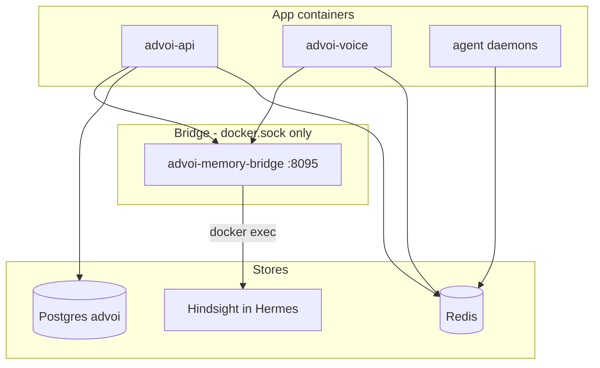

# Memory and data

ADVoi uses a **hybrid memory model** (ADR-026). Strategic recall goes through Hermes Hindsight; canonical state lives in Postgres; ephemeral session data in Redis.

Full operator guide: [../MEMORY-STACK.md](../MEMORY-STACK.md)

## Tier diagram

## Write targets

`advoi/memory/write_targets.py` routes events to explicit targets (no double-write):

| Event type | Primary store |
|------------|---------------|
| `portfolio_fact` | Hindsight |
| `user_preference` | Letta (when enabled) |
| `voice_turn` | Redis rolling window |
| `runtime_error` | Guardian log (not beliefs) |

## Brief Curator data paths

1. **Fast path** — `redis:advoi:briefs:open` (JSON list)
2. **Canonical** — Postgres `decision_briefs` via `postgres_store.py`
3. **Strategic** — Hindsight recall via `MemoryRouter`

Seed script: `scripts/seed-advoi-briefs.sh` (requires Hermes + optional Redis/Postgres containers).

Local seed without Hermes: `scripts/seed-local-briefs.py`

## Voice session memory

- **Recall** at bot join — `MemoryRouter.recall()` in `agent.py`
- **Retain** after turns — `VoiceMemoryProcessor` in pipeline (`memory_hooks.py`)
- Session id default: `voice-main`

## Fleet data

Fleet Scout reads **read-only** files under `FIRSTMATE_FLEET_PATH` (default `/opt/firstmate-fleet`). No write access to fleet config.

## Gaps

| Gap | Impact |
|-----|--------|
| Letta disabled (`LETTA_ENABLED=false`) | No operational/identity memory |
| Bridge fails if Hermes down | Recall/retain degrades; briefs may still work from Redis/Postgres |
| No memory compaction / TTL policy for Postgres events | Long-term growth unmanaged |
| Hindsight indexing delay after seed | Brief curator may return empty briefly after seed |