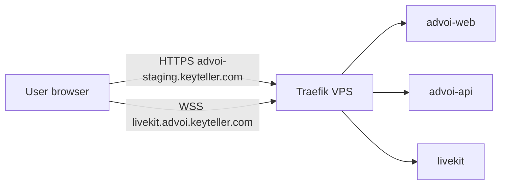

# Deployment topology

## Environments

| Environment | Host | Path | Compose | Profile |
|-------------|------|------|---------|---------|
| Local dev | `127.0.0.1` | workspace | `docker-compose.yml` | `app` |
| Develop VPS | — | `/data/projects/advoi` (`develop`) | local/dev checkout | — |
| Staging VPS | `advoi-staging.keyteller.com` | `/var/www/advoi/staging` | + `deploy/docker-compose.staging.yml` | `app` |
| Live VPS | `advoi.keyteller.com` | `/var/www/advoi/live` | production tree | `app` |
| LiveKit public | `livekit.advoi.keyteller.com` | (shared Traefik) | Traefik labels in staging overlay | `app` |
| Legacy (deprecating) | historically `advoi.keyteller.com` | `/opt/advoi` | old single-path stack | `app` |

Canonical layout and promote: [docs/VPS-SETUP.md](../VPS-SETUP.md). Clone-only policy still applies — never rsync over sibling projects.

## Docker services (profile `app`)

| Service | Image | Port (host) | Role |
|---------|-------|-------------|------|
| `postgres` | postgres:16-alpine | 5438 | Canonical DB |
| `redis` | redis:7-alpine | 6382 | Cache + voice turns |
| `advoi-api` | advoi/api:local | 8010 | HTTP API |
| `advoi-web` | advoi/web:local | 3000 | Next.js PWA |
| `livekit` | livekit-server | 7880 | WebRTC SFU |
| `advoi-voice` | advoi/voice:local | 8011 | Pipecat worker |
| `advoi-memory-bridge` | advoi/api:local | 8095 | Hindsight HTTP bridge |
| `advoi-agent-fleet` | advoi/api:local | — | Fleet Scout daemon |
| `advoi-agent-briefs` | advoi/api:local | — | Brief Curator daemon |
| `advoi-agent-review` | advoi/api:local | — | Review Queue daemon |

Network: `advoi-network` (compose project `advoi`).

## Staging traffic flow



Live uses the same Traefik pattern with host `advoi.keyteller.com` and tree `/var/www/advoi/live`.

## Deploy pipeline

### Preferred (www promote)

```bash
bash /var/www/advoi/promote-to-staging.sh
curl https://advoi-staging.keyteller.com/api/health
```

### Legacy (`/opt/advoi` until cutover)

```bash
cd /opt/advoi
cp deploy/.env.staging.example deploy/.env   # if missing
bash scripts/ensure-deploy-secrets.sh
bash scripts/sync-llm-keys-from-clapart.sh   # optional key sync
DEPLOY_MODE=staging bash scripts/vps-deploy.sh --profile app
```

### Shelve safety

`scripts/vps-deploy.sh` disables Shelve pull by default (`ADVOI_SHELVE_PULL=true` to enable). Shelve has corrupted `deploy/.env` (char-per-line split, merged keys). Deploy script auto-restores from `deploy/.env.staging.example` when corrupt.

## Env files

| File | Use |
|------|-----|
| `deploy/.env.staging.example` | VPS staging template |
| `deploy/.env.local.example` | Local Docker / mock testing |
| `deploy/.env` | Active env (gitignored) |

## Health checks

| Check | Command |
|-------|---------|
| API | `curl /api/health` |
| Voice config | `curl /api/diagnostics/voice` |
| Multi-agent | `scripts/agents-smoke-test.ps1` |
| Full journey | `scripts/voice-smoke-test.sh` |
| Memory | `scripts/memory-health.sh` |

## Portfolio dependencies (read-only)

| Dependency | Path / container |
|------------|------------------|
| Hermes | `hermes` container |
| FirstMate fleet | `/opt/firstmate-fleet` mount |
| Clapart LLM keys | `/opt/clapart/deploy/.env` sync script |