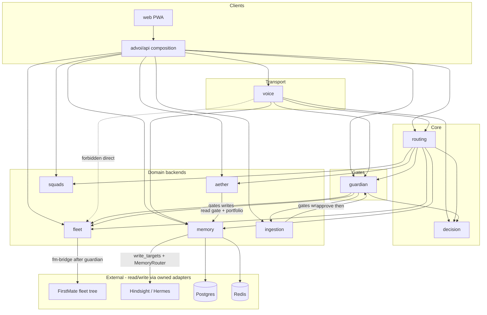

# Vertical boundaries

**Status:** Target rules (enforce in design + code review)  
**Baseline:** develop @ `e71607f`  
**Source:** [ARCHITECTURE-DATA-MEMORY-REVIEW](../reviews/ARCHITECTURE-DATA-MEMORY-REVIEW.md) vertical rules · [01-system-overview.md](01-system-overview.md) · ADR-026

Domain verticals own a bounded capability. Callers reach side effects through **routing**, **Guardian**, and **MemoryRouter** — not by reaching shell, Hermes, or fleet tree directly.

Related: [04-memory-and-data.md](04-memory-and-data.md) · [07-portfolio-event-log.md](07-portfolio-event-log.md) · [08-system-logic-flows.md](08-system-logic-flows.md) · [AGENTS.md](../../AGENTS.md)

---

## Dependency diagram (target)

Allowed edges only. Composition roots (`api`, `cli`) may assemble verticals; they are not domain verticals.



### Target call chain (one line)

```text
voice → routing (frames / intents) → vertical backends (fleet, memory, aether, …)
         never: voice → fleet shell / fm-bridge directly

guardian → gates ALL consequential writes (fleet trigger, ingestion dispatch, review queue)

memory → write_targets only; no module calls Hindsight except via MemoryRouter

aether → read gate + portfolio; enrich frames; no fleet writes

ingestion → route → (approve) → guardian → fleet
```

---

## Rules per vertical

### Voice (`advoi/voice/`)

| | Rule |
|--|------|
| **Owns** | LiveKit/Pipecat transport, tokens, STT/TTS pipeline, spoken turn retain hooks, data-channel frame dispatch into routing |
| **May depend on** | `routing`, `decision` (catalog/labels), `memory` (via `MemoryRouter`), `guardian` (confirm phrases / policy), `llm`, `cache`, `analytics` (PEL thin events), `observability` |
| **Must not** | Invoke `fm-bridge`, `fleet.trigger`, or shell into FirstMate; own frame business logic; call Hindsight / docker exec |
| **Inbound from** | `api`, composition scripts, Docker `advoi-voice` |

**Why:** Thin voice layer (ADR-004). Intelligence and side effects stay in routing + backends.

### Routing (`advoi/routing/`)

| | Rule |
|--|------|
| **Owns** | Agent registry, frame runner, daemons/supervisor, intent classification, orchestration entry points |
| **May depend on** | `decision`, `memory`, `aether` (post-frame enrich), `guardian` (confirm gates), `squads`, `fleet` (read/trigger via fleet module), `cache`, `analytics` |
| **Must not** | Bypass Guardian for consequential fleet/ingestion writes; double-write memory outside `MemoryRouter`; hardcode Hindsight URLs |
| **Inbound from** | `api`, `voice`, agent daemons |

**Why:** Single execution spine for frames so PWA, voice, and daemons share one path.

### Decision (`advoi/decision/`)

| | Rule |
|--|------|
| **Owns** | Frame catalog (ids, labels, confirmation flags) |
| **May depend on** | Nothing domain-specific (leaf catalog) |
| **Must not** | Run frames, touch stores, call fleet/memory |
| **Inbound from** | `routing`, `guardian`, `api`, `voice`, `ontology` (when validating) |

**Why:** Catalog is data; execution lives in routing.

### Memory (`advoi/memory/`)

| | Rule |
|--|------|
| **Owns** | `MemoryRouter`, `write_targets` / `EVENT_WRITE_MAP`, Postgres/Redis/Letta adapters, Hindsight client, memory-bridge server, review queue storage |
| **May depend on** | `cache`, `observability` (trace ids) |
| **Must not** | Own frame UX; trigger fleet; expose raw docker.sock outside `bridge_server` / hermes path |
| **Inbound from** | `routing`, `voice`, `api`, `aether`, `squads`, `guardian` (logs / failures) |

**Write rule (ADR-026):** one primary target set per `MemoryEventType`. No double-write. External modules call `MemoryRouter.recall` / `retain` only — never `retain_strategic` / bridge internals.

**Audit:** any `retain_strategic` or direct Hindsight call outside `advoi/memory/{router,hindsight,bridge_server}.py` (and bridge scripts) is a violation. Guard: `tests/test_memory_retain_audit.py`.

### Guardian (`advoi/guardian/`)

| | Rule |
|--|------|
| **Owns** | Confirmation policy, recovery logging, notifications, auto-restart hooks |
| **May depend on** | `decision` (which frames need confirm), `memory` (runtime_error / guardian log targets), `routing` (read-only status helpers if needed) |
| **Must not** | Execute fleet jobs itself without going through `fleet` after policy pass; become a general orchestrator |
| **Inbound from** | `api`, `voice`, `routing`, `fleet`, `ingestion` |

**Write rule:** **All consequential writes** (fleet trigger, ingestion dispatch to FM, review-queue side effects) evaluate Guardian first. Confirmation-required frames need explicit confirm (voice phrase, double-tap, or `confirmed=true`).

### Aether (`advoi/aether/`)

| | Rule |
|--|------|
| **Owns** | Gate verdict, portfolio snapshot, architect/lifecycle, gate export (git path and/or PEL) |
| **May depend on** | `memory` (retain lessons/beliefs via router), `routing` (post-frame hooks), `analytics` (PEL governance events) |
| **Must not** | Write fleet tree or invoke `fm-bridge`; mutate ingestion lifecycle |
| **Inbound from** | `api`, `routing` (post-frame), `voice` (status chips via API) |

**Why:** Governance enrich only — Aether reads gate + portfolio and may retain structured lessons; fleet execution stays in fleet + Guardian.

### Fleet (`advoi/fleet/`)

| | Rule |
|--|------|
| **Owns** | `fm-bridge` adapter, trigger API helpers, session/idempotency window |
| **May depend on** | `guardian` (must gate before invoke), `routing` (shared types/copy), `analytics` (PEL `fleet_trigger`), `copy_style` |
| **Must not** | Be imported by `voice` for shell dispatch; skip Guardian on live invoke; dump full fleet backlog into Hindsight |
| **Inbound from** | `api`, `routing` (scout/read + gated trigger), `ingestion` (after approve + guardian) |

**Audit:** any `fm-bridge` invoke outside Guardian-gated `fleet` / `api` paths is a violation.

### Squads (`advoi/squads/`)

| | Rule |
|--|------|
| **Owns** | Squad registry, dispatch, run-six / platform orchestration stubs toward webhooks |
| **May depend on** | `routing`, `memory` (lessons via router) |
| **Must not** | Direct Hermes or fleet shell; bypass confirmation for high-stakes squads (staging max autonomy — D-07) |
| **Inbound from** | `api`, `routing` |

### Ingestion (`advoi/ingestion/`) — vertical-leaning horizontal

| | Rule |
|--|------|
| **Owns** | Upload, parse, route, store, lifecycle status machine |
| **May depend on** | `aether` (optional enrich), `fleet` (dispatch only after approve), `guardian` (gate dispatch) |
| **Must not** | Auto-dispatch on upload; call fleet before status `approved` |
| **Lifecycle (target):** | `uploaded → triaged → needs_review → approved → dispatched` |

**Chain:** `ingestion → route → (approve) → guardian → fleet`

### API (`advoi/api/`) — composition root

| | Rule |
|--|------|
| **Owns** | HTTP surface, authz (when added), request wiring |
| **May depend on** | All verticals as a **facade** only — no business rules that belong in routing/memory/guardian |
| **Must not** | Reimplement frame runner or memory write maps; call docker exec for Hermes (use memory-bridge) |

### LLM (`advoi/llm/`)

| | Rule |
|--|------|
| **Owns** | OpenRouter / credential resolution |
| **May depend on** | Config only |
| **Must not** | Own memory or fleet side effects |

---

## Horizontals (cross-cutting)

| Horizontal | Path | Boundary note |
|------------|------|---------------|
| Ontology | `advoi/ontology/` | May validate frames/agents against catalogs; must not execute frames |
| Observability | `advoi/observability/` | May read graph/status; must not own domain writes |
| Reporting | `advoi/reporting/` | Stub — future consumers of PEL / memory_events, not writers of fleet |
| Analytics / PEL | `advoi/analytics/` | Append-only `portfolio_events` via `append_event`; not a Hindsight double-write (see [07-portfolio-event-log.md](07-portfolio-event-log.md)) |
| Cache | `advoi/cache/` | Redis helpers for agent last_run; no strategic memory |

---

## Allowed vs forbidden summary

| From → To | Allowed? | Notes |
|-----------|----------|--------|
| voice → routing | Yes | Frames / intents |
| voice → memory (router) | Yes | Recall / retain turns |
| voice → fleet / fm-bridge | **No** | Route through API/routing + Guardian |
| routing → fleet | Yes | Scout reads; triggers only after Guardian |
| any → retain_strategic | **No** except memory internals | Use `MemoryRouter.retain` |
| any → Hindsight docker exec | **No** except memory bridge path | Isolates docker.sock |
| aether → fleet write | **No** | Read gate + portfolio only |
| ingestion → fleet | Yes after approve + Guardian | Not on upload |
| guardian → fleet invoke path | Yes | Policy gate before side effect |
| * → Postgres briefs | Via memory stores | Postgres canonical for briefs; Redis cache only |

---

## System flows (boundary checkpoints)

1. **Frame run** — PWA/API → `frame_runner` → backend (fleet files / memory / aether) → Redis cache → `spoken_summary`. PEL: `frame_run` when enabled.
2. **Voice intent** — transcript → routing capabilities → respond or frame → Guardian if confirm-required → never voice-owned shell.
3. **Fleet trigger** — API → Guardian evaluate → `fleet` / fm-bridge → fleet tree. PEL: `fleet_trigger`. Idempotency key optional (60s).
4. **Ingestion** — upload → parse → route → **approve** → Guardian → fleet dispatch.
5. **Post-frame Aether** — frame result → architect hook → `MemoryRouter` retain (`squad_lesson` / belief) + optional gate export / PEL `governance_decision`.

Each flow that writes should leave: Guardian record (when consequential), PEL row (when built), and memory retain only through write targets.

---

## Code-review checklist

- [ ] No new `voice` import of `advoi.fleet.trigger` / bridge shell helpers
- [ ] No `retain_strategic` / `aretain` outside `advoi/memory/`
- [ ] No Hindsight client use outside memory package + bridge
- [ ] Fleet live invoke goes through Guardian confirmation when policy requires
- [ ] Ingestion dispatch requires `approved` (not `uploaded` / `routed` alone)
- [ ] Aether changes do not write fleet backlog
- [ ] New event types registered in `EVENT_WRITE_MAP` (or explicitly non-retained)
- [ ] Consequential paths emit PEL when `portfolio_events` is the authority

---

## Known pressure points (not free passes)

These exist in the tree today and should trend toward the target diagram — they are not licenses to add more violations:

| Pressure | Intentional fix direction |
|----------|---------------------------|
| Composition modules (`api`, sometimes `voice`) import many verticals | Keep as thin wiring; push logic down into routing/backends |
| `voice` historically imported `fleet` helpers | Prefer API/routing for triggers; voice stays transport + spoken UX |
| Triple brief read path (historical) | Postgres canonical, Redis cache, Hindsight enrich-only — see ADR-026 / AGENTS.md |

---

## Changelog

| Date | Change |
|------|--------|
| 2026-07-10 | Initial vertical boundary doc from ARCHITECTURE-DATA-MEMORY-REVIEW rules @ `e71607f` |
