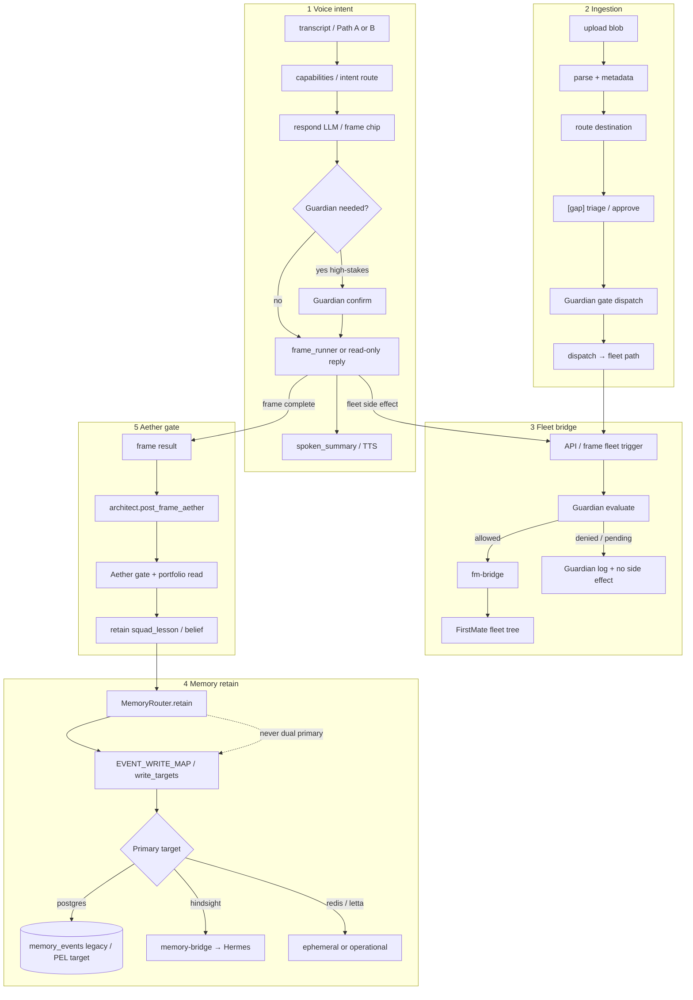

# System logic flows

**Status:** As-implemented target chains (gaps called out)  
**Source:** [ARCHITECTURE-DATA-MEMORY-REVIEW § System logic](../reviews/ARCHITECTURE-DATA-MEMORY-REVIEW.md#system-logic-flows-to-validate) · vertical rules in the same review · [06-vertical-boundaries.md](06-vertical-boundaries.md)

Five control-plane flows to keep consistent in design and code review: **voice intent**, **ingestion**, **fleet bridge**, **memory retain**, and **Aether gate**. Each consequential write should eventually emit a PEL row (when built), a Guardian record, and a `trace_id` (when OTel is on).

Related: [02-voice-paths.md](02-voice-paths.md) · [04-memory-and-data.md](04-memory-and-data.md) · [03-multi-agent.md](03-multi-agent.md)

---

## Flow diagram (five paths)



### One-line chains

| # | Flow | Chain |
|---|------|--------|
| 1 | **Voice intent** | transcript → capabilities → respond → Guardian? → frame or fleet → spoken_summary |
| 2 | **Ingestion** | upload → parse → route → **[missing approve]** → Guardian → dispatch |
| 3 | **Fleet bridge** | API / trigger → Guardian evaluate → fm-bridge → fleet tree (side effect); Discord crew reply contract: [../operations/DISCORD-WORKFLOW.md](../operations/DISCORD-WORKFLOW.md) |
| 4 | **Memory retain** | caller → `MemoryRouter.retain` → `write_targets` → single primary store (Postgres / Hindsight / Redis / Letta) |
| 5 | **Aether gate** | frame result → `architect.post_frame_aether` → gate + portfolio → retain `squad_lesson` / belief |

Also related (not drawn as a sixth swimlane): **Frame run** — PWA/API → `run_frame` → **agent cache → (mock) → backends** → `spoken_summary` (precedence, cache keys, and fallbacks: [03-multi-agent.md § Resolution precedence](03-multi-agent.md#resolution-precedence-run_frame)).

---

## Boundary rules (must hold on every flow)

```text
voice     → routing (frames/intents) → vertical backends (fleet, memory, aether)
          → never: voice → fleet shell / fm-bridge directly

guardian  → gates ALL consequential writes (fleet, ingestion dispatch, review queue)

memory    → write_targets only; no module calls Hindsight except via MemoryRouter

aether    → read gate + portfolio; enrich frames; no fleet writes

ingestion → route → (approve) → guardian → fleet
```

**Audit:** any `fm-bridge` or `retain_strategic` call outside Guardian + MemoryRouter paths is a violation.

---

## Gaps to validate (from review)

| Flow | Known gap |
|------|-----------|
| Voice | Path B/C matrix incomplete; free-speech NLU limited |
| Ingestion | Status enum missing `triaged` / `needs_review` / `approved` |
| Fleet bridge | No idempotency; no PEL mirror yet |
| Memory retain | Silent retain failures; brief triple-path; `memory_events` → PEL cutover |
| Aether gate | Gate artifacts VPS-only; no fleet writes allowed |

---

## Cross-links

| Doc | Why |
|-----|-----|
| [ARCHITECTURE-DATA-MEMORY-REVIEW.md](../reviews/ARCHITECTURE-DATA-MEMORY-REVIEW.md) | Source § System logic + vertical rules |
| [06-vertical-boundaries.md](06-vertical-boundaries.md) | Dependency diagram + import/write rules |
| [04-memory-and-data.md](04-memory-and-data.md) | Authority matrix + retain targets |
| [02-voice-paths.md](02-voice-paths.md) | Path A/B sequence detail |
| [03-multi-agent.md](03-multi-agent.md#resolution-precedence-run_frame) | `run_frame` cache / mock / refresh / backend order |
| [07-portfolio-event-log.md](07-portfolio-event-log.md) | PEL emit points for these flows |
