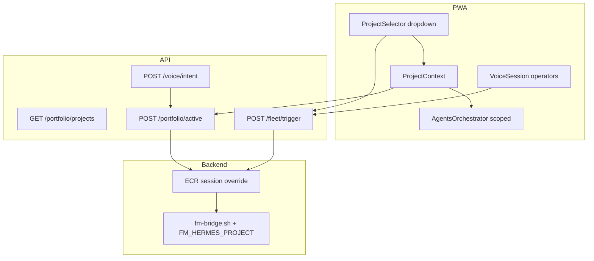

# What we did — portfolio project selector + FirstMate wiring (2026-07-11)

Session summary and **quick start for the next session**.  
**Repo:** `advoi-system` @ `5b7040b`  
**Staging:** https://advoi.keyteller.com (canonical deploy path `/opt/advoi`)  
**Tests:** ~726 pytest collected; web build passing

---

## Executive summary

This session added a **portfolio project selector** to the PWA shell and wired **FirstMate fleet actions** to the active venture. You can now point ADVoi at a project via UI, voice, or API, scope the Agents tab, and wake FirstMate from the project dropdown.

**Staging is deployed** through `5b7040b`. T2 smoke passes. Human phone E2E is still the main gap.

---

## Commits (this session, newest first)

| Commit | Summary |
|--------|---------|
| `5b7040b` | Wake FirstMate + fleet actions in project dropdown (confirm flow) |
| `d60a00e` | Voice operator row uses project bar `fleet_slug` (not stale profile only) |
| `56541bb` | E2E use case test playbook (`E2E-USE-CASE-TESTS.md`) |
| `541283d` | Portfolio project selector: API, voice, Agents scoping, session ECR override |

Earlier context (Agents orchestration R12-15): `e6ec64a`, `af16a18`, `4a4a7ba`, `77f5c87`.

---

## 1. Project selector (PWA shell)

**Where:** Top bar above Voice / Agents / Briefs / More tabs.

**Capabilities:**
- Dropdown lists 4 portfolio ventures (from `data/aether/portfolio.json` + ECR)
- Select venture → scopes Agents squads/frames
- Function chips per venture (primary frames + bets)
- Add custom feature labels (localStorage)
- Persists selection in localStorage + server session

**API:**
```
GET  /api/portfolio/projects
POST /api/portfolio/active   { "venture_id": "...", "function_id": "..." }
```

**Voice:**
- "switch to gem dev shop"
- "open advoi"
- "fleet status on advoi" (switch + run frame)

**Key files:**
```
web/components/shell/ProjectSelector.tsx
web/components/shell/ProjectContext.tsx
web/lib/portfolio/projectModel.ts
web/lib/portfolio/projectCatalog.ts
advoi/portfolio/projects.py
advoi/portfolio/ecr.py          # set_session_active_venture()
```

**Venture → fleet slug:**

| Venture | fleet_slug |
|---------|------------|
| advoi-system | advoi |
| gem-dev-shop | gem-dev-shop |
| firstmate-fleet | clapart |
| hermes-beacon | hermes |

---

## 2. FirstMate + project bar integration

**Problem solved:** Fleet UI buttons used FirstMate profile `active_slug` only; project bar selection was ignored.

**Fix (`d60a00e`):** `VoiceSession` fleet operators read `ProjectContext.activeVenture.fleet_slug` first.

**Dropdown fleet section (`5b7040b`):** Project panel shows **FirstMate on {slug}** with:
- Wake FirstMate
- Start dev
- Next backlog
- Stop fleet

Two-tap confirm: action → Guardian prompt → Confirm.

**Shared client:** `web/lib/portfolio/fleetTrigger.ts`

**Backend resolution order** (`resolve_active_project`):
1. `on/for/project X` in transcript
2. Session override from `POST /api/portfolio/active`
3. ECR / gate / fleet profile / `FM_HERMES_PROJECT` env

**Integration tests added:**
- `test_wake_firstmate_uses_session_after_portfolio_active`
- `test_wake_firstmate_uses_session_venture_slug`

---

## 3. E2E documentation

**New:** `docs/operations/E2E-USE-CASE-TESTS.md`

- 17 use cases (UC-01 to UC-17)
- 6 test sessions (15-90 min)
- Automated pre-checks
- Pass/fail tables
- 15-minute phone smoke script

Linked from `MANUAL-TEST-TRACKER.md`, `E2E-SIGNOFF.md`, `docs/operations/README.md`.

---

## 4. Staging deploy status

| Check | Status |
|-------|--------|
| VPS HEAD | `5b7040b` |
| T2 smoke | PASSED (multiple redeploys) |
| `GET /api/health` | 6/6 agents warm |
| `GET /api/portfolio/projects` | 200, 4 ventures |
| `GET /api/frames` | 6 frames A-F |
| Aether gate | pass, active `gem-dev-shop` |

**Not human-validated yet:** Most rows in `MANUAL-TEST-TRACKER.md` still "Not tested".

---

## 5. Known gaps (next session)

| Gap | Priority |
|-----|----------|
| Human phone E2E (UC-01 to UC-17) | P0 |
| Session project override resets on API restart | P1 |
| Custom features client-only (no backlog ticket) | P2 |
| Live squad webhook (`ADVOI_SQUAD_MOCK=false`) | P2 |
| `LETTA_ENABLED=true` on VPS | P2 |
| Ingestion approve → fleet chain | P3 |

---

## Quick start — new session

### 1. Orient (2 min)

```bash
cd /opt/advoi   # VPS
# or locally:
cd D:\Down\livekit-agent\deployment\advoi\advoi-system

git log -1 --oneline          # expect 5b7040b or newer
git fetch origin && git status
```

**Read first:**
- This file (`WHAT-WE-DID-2026-07-11.md`)
- `docs/operations/E2E-USE-CASE-TESTS.md` (test playbook)
- `docs/architecture/08-system-logic-flows.md` (5 backend flows)

### 2. Verify staging (5 min)

```bash
curl -sf https://advoi.keyteller.com/api/health
curl -sf https://advoi.keyteller.com/api/portfolio/projects | head -c 200
```

```powershell
$env:ADVOI_BASE_URL = "https://advoi.keyteller.com"
.\scripts\staging-signoff-precheck.ps1
```

Expected: `agents_ready: 6`, portfolio API 200.

### 3. Redeploy if needed (5 min)

```bash
ssh deploy@187.77.140.216 "cd /opt/advoi && git fetch origin && git reset --hard origin/master && bash scripts/staging-redeploy.sh"
```

Hard refresh PWA: `Ctrl+Shift+R`.

### 4. Local dev (optional)

```bash
uv sync
uv run pytest tests/ -q
cd web && npm run build
```

### 5. First human test (15 min)

Open https://advoi.keyteller.com on phone:

1. Project bar → **ADVoi System**
2. **FirstMate on advoi** → Wake FirstMate → Confirm
3. Connect voice → say **"systems pulse"**
4. Agents tab → run morning preset
5. Mark PASS/FAIL in `E2E-USE-CASE-TESTS.md` UC-02, UC-03, UC-17

### 6. High-value next builds

| If you want... | Start here |
|----------------|------------|
| Close operational gap | Run full E2E sign-off (UC-01 to UC-15) |
| Persist project across restarts | ECR write or fleet profile sync on `portfolio/active` |
| Custom features → backlog | Wire `UserProjectFeature` to Paperclip/tickets API |
| Live fleet execution | `ADVOI_SQUAD_MOCK=false` + Discord webhook on VPS |
| Memory on VPS | `LETTA_ENABLED=true` in `.env` |

---

## Key commands cheat sheet

| Task | Command |
|------|---------|
| Run all tests | `uv run pytest tests/ -q` |
| Project selector tests | `uv run pytest tests/test_project_selector.py tests/test_fleet_trigger.py -q` |
| Web build | `cd web && npm run build` |
| Staging redeploy | `ssh deploy@187.77.140.216 "cd /opt/advoi && git fetch && git reset --hard origin/master && bash scripts/staging-redeploy.sh"` |
| Activate project (API) | `curl -X POST .../api/portfolio/active -d '{"venture_id":"advoi-system"}'` |
| Wake FirstMate (API) | `curl -X POST .../api/fleet/trigger -d '{"action":"wake_firstmate","confirmed":true,"project":"advoi"}'` |
| Voice intents | `curl -X POST .../api/voice/intent -d '{"transcript":"switch to advoi"}'` |

---

## Architecture snapshot (this session)



---

## File map (new/changed this session)

```
advoi/portfolio/projects.py          # catalog, voice match, activate
advoi/portfolio/ecr.py               # set_session_active_venture
advoi/api/app.py                     # portfolio + voice intent fields
advoi/voice/respond.py               # voice project switch
tests/test_project_selector.py
tests/test_fleet_trigger.py          # portfolio/active integration

web/components/shell/ProjectSelector.tsx
web/components/shell/ProjectContext.tsx
web/components/shell/projectSelector.module.css
web/lib/portfolio/projectModel.ts
web/lib/portfolio/projectCatalog.ts
web/lib/portfolio/fleetTrigger.ts
web/components/VoiceSession.tsx      # fleet slug from project bar
web/components/agents/AgentsOrchestrator.tsx  # venture scoping

docs/operations/E2E-USE-CASE-TESTS.md
docs/current-state/WHAT-WE-DID-2026-07-11.md   # this file
```

---

## Session handoff checklist

- [x] Project selector built and deployed
- [x] Voice project switch deployed
- [x] Fleet operators wired to project bar
- [x] Wake FirstMate in project dropdown
- [x] E2E test playbook written
- [x] Integration tests for portfolio → fleet
- [ ] Human phone sign-off recorded
- [ ] MANUAL-TEST-TRACKER rows updated from E2E run
- [ ] Letta enabled on VPS
- [ ] Live squad dispatch enabled

**Next session owner:** Run UC-01 + UC-17 on phone, log results, then pick one P1 gap (persist project or custom feature backlog).