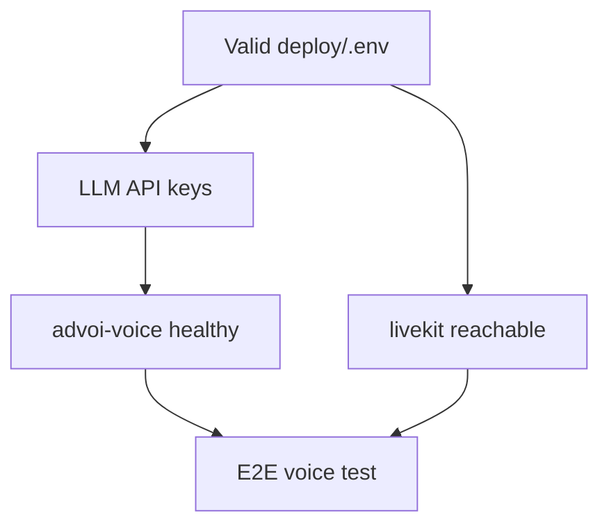

# Gaps and blockers

Issues that prevent calling ADVoi "production validated" today.

## P0 — Blocks staging voice

### 1. Voice container crash-loop (no audio)

**Symptom:** PWA connects (green), frame text appears, user hears nothing.

**Cause:** `advoi-voice` exits when `OPENAI_API_KEY` / `OPENROUTER_API_KEY` missing after `.env` restore from staging template.

**Error:** `RuntimeError: OPENROUTER_API_KEY or OPENAI_API_KEY is required for ADVoi voice`

**Fix:**

```bash
cd /opt/advoi
bash scripts/sync-llm-keys-from-clapart.sh
bash scripts/ensure-deploy-secrets.sh
docker compose --profile app up -d --force-recreate advoi-voice
bash scripts/voice-smoke-test.sh
```

### 2. Shelve corrupts `deploy/.env`

**Symptom:** Traefik 404, API unreachable, merged env lines (`LIVEKIT_API_SECRET=secretHINDSIGHT_BRIDGE_URL=...`).

**Mitigation shipped:** `ADVOI_SHELVE_PULL=false` by default; corrupt file auto-restore in `vps-deploy.sh`.

**Remaining gap:** Shelve root cause not fixed; do not enable pull until token/format is repaired.

### 3. End-to-end voice not signed off

No recorded CI or human sign-off that mic → STT → LLM → TTS works on staging after last deploy.

---

## P1 — Functional gaps

| Gap | Detail |
|-----|--------|
| Review queue persistence | `queue_deep_review` returns stub; no Postgres queue, no desktop brief URL |
| Intent routing edge cases | Keyword classifier shipped (`advoi/routing/intent.py`); multi-turn confirm in LiveKit path still relies on PWA buttons |
| Client voice path (Path B) | `voice-interface/`, `/voice-local`, Kokoro/Parakeet deps, and `POST /api/voice/respond` landed; browser model load and iOS WebGPU not validated on staging |
| Memory bridge without Hermes | Local dev without Hermes: bridge returns errors (non-fatal for mock frames) |

### Recently resolved (2026-07-08)

| Item | Status |
|------|--------|
| `plain_copy` / em dashes | `advoi/copy_style.py`; frame labels use `Option A:` colon format; spoken output normalized |
| `/api/voice/respond` | Implemented in `advoi/api/app.py`; used by `VoiceLoop` |
| `/api/voice/intent` | Keyword classify + optional frame preview; wired in `VoiceLoop` and `warm_spoken_reply` |
| Agent `last_run` cache | `advoi/cache/agent_cache.py` wired into `GET /api/agents` |

---

## P2 — Platform / portfolio gaps

| Gap | Detail |
|-----|--------|
| Port registry in `vps-shared` | Row may exist on VPS only, not synced to shared repo |
| DNS/TLS intermittently 404 | Traefik labels depend on valid `.env` `PROJECT_SLUG` and host rules |
| Letta operational memory | Disabled; identity prefs not stored |
| Observability | OTel collector profile exists; not wired into app traces |
| Aether / Guardian / Squads | Package stubs only |

---

## P3 — Quality and UX

| Gap | Detail |
|-----|--------|
| Agent interval 45s default | First `last_run` cache delay; acceptable for prod, slow for demos |
| No agent dashboard | No React Flow or status UI beyond PWA status line |
| iOS WebGPU / client voice | Path B scaffold present; not E2E tested on device |
| WSL vs Windows localhost | Bash smoke from WSL cannot hit Windows-bound API on `127.0.0.1:8010`; use `.ps1` |
| Stale governance docs | `PLAN-SETUP-REVIEW.md`, `.aether/STAGE.md` behind actual build |

---

## Blocker dependency graph



## Definition of "ready for testing"

Minimum bar:

1. `deploy/.env` has LLM keys and LiveKit keys
2. `docker compose --profile app ps` shows api, voice, livekit, 3 agents up
3. `scripts/agents-smoke-test.ps1` passes
4. `scripts/voice-smoke-test.sh` passes against staging URL
5. Human: connect PWA, hear greeting, tap frame, hear spoken summary