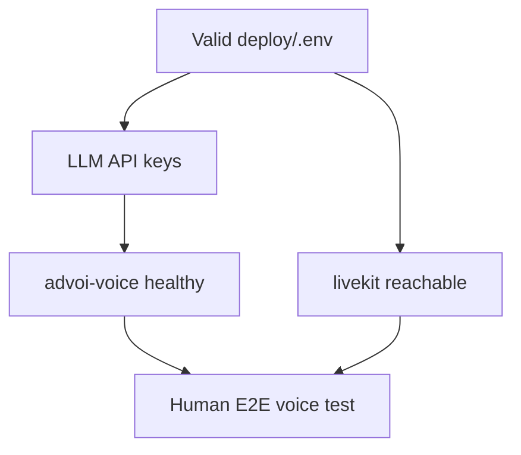

# Gaps and blockers

What prevents calling ADVoi **production validated** today.

**Last verified:** 2026-07-08  
**Staging health:** API 200, voice diagnostics `ok: true`, 3/3 agents cached

---

## Executive summary

| Category | Count | Notes |
|----------|-------|-------|
| P0 (blocks validation) | 1 open | Human E2E sign-off |
| P0 (mitigated) | 2 | LLM keys, Shelve corruption |
| P1 (functional depth) | 3 open | Device confirm, Path B, latency |
| P2 (platform) | 5 open | Letta, OTel, Aether, dashboard, port registry |

**Bottom line:** Code is feature-complete for Build 1.5. The critical path is one human voice test on a phone.

---

## P0 — Blocks staging validation

### 1. Human E2E voice not signed off

**Status:** **Open** — highest priority.

**Symptom:** No recorded proof that mic → STT → LLM → TTS works on staging after last deploy.

**What works today (automated):**
- `/api/diagnostics/voice` → `ok: true`
- `/api/agents` → 3/3 ready with `last_run`
- `voice-smoke-test.sh` passes against staging URL

**What is missing:** A human on a real device hears greeting and frame TTS.

**Action:** Complete [E2E-SIGNOFF.md](../operations/E2E-SIGNOFF.md) and record in DEV-LOG.

---

### 2. Voice container crash-loop (no audio)

**Status:** **Mitigated** — staging voice healthy as of 2026-07-08.

**Symptom:** PWA connects (green), frame text appears, user hears nothing.

**Cause:** `advoi-voice` exits when `OPENAI_API_KEY` / `OPENROUTER_API_KEY` missing after `.env` restore.

**Fix if it recurs:**

```bash
cd /opt/advoi
bash scripts/sync-llm-keys-from-clapart.sh
ADVOI_SHELVE_PULL=false DEPLOY_MODE=staging bash scripts/ensure-deploy-secrets.sh
docker compose -f docker-compose.yml -f deploy/docker-compose.staging.yml \
  --env-file deploy/.env --profile app up -d --force-recreate advoi-voice
bash scripts/voice-smoke-test.sh
```

---

### 3. Shelve corrupts `deploy/.env`

**Status:** **Mitigated** — pull disabled by default.

**Symptom:** Traefik 404, API unreachable, merged env lines.

**Mitigation:** `ADVOI_SHELVE_PULL=false`; corrupt file auto-restore; `repair-vps-env.sh`.

**Remaining gap:** Do not re-enable Shelve pull until token/format validated end-to-end.

---

### 4. Traefik / staging env (was P0, now mitigated)

**Status:** **Mitigated** — verified 2026-07-08.

**Was:** VPS had local dev template (no `STOREFRONT_HOST`) → Next.js 404 on `/api/*`.

**Fix shipped:** `ensure-deploy-secrets.sh` merges staging hosts when `DEPLOY_MODE=staging`; `repair-vps-env.sh` recreates edge services.

**Verify:** `curl https://advoi.keyteller.com/api/health` → 200.

---

## P1 — Functional gaps

| Gap | Detail | Status |
|-----|--------|--------|
| LiveKit two-turn confirm | Wired in `intent_processor.py`; say "queue review" → "yes" on device | **Open** — needs device test |
| Path B client voice | `/voice-local`, Kokoro/Parakeet; browser model load + iOS WebGPU not validated | **Open** |
| Voice latency target | API path SLA passes (`sla_ok: true`, ~35ms); baseline in `docs/operations/latency-baseline.json`; full mic-STT-TTS TBD | **Partial** |
| Memory bridge without Hermes | Non-fatal mock fallback; diagnostics report `memory_bridge_ok` and `memory_bridge_mode` | **Mitigated** |
| Review queue UI | Postgres + `GET /api/review-queue` + PWA list | **Resolved** |
| Intent routing | Keyword classifier + LiveKit STT processor + Path B loop | **Resolved** |

---

## P2 — Platform / portfolio gaps

| Gap | Detail | Status |
|-----|--------|--------|
| Port registry in `vps-shared` | Row may exist on VPS only | Open |
| Letta operational memory | Disabled; identity prefs not stored | Open |
| Observability | OTel collector profile exists; app traces not wired | Open |
| Aether / Guardian / Squads | Package stubs only | Open |
| Agent dashboard | No React Flow; PWA status line only | Open |

---

## P3 — Quality and UX

| Gap | Detail | Status |
|-----|--------|--------|
| Agent interval on prod | 45s default; staging uses 15s for faster demos | Acceptable |
| No PWA service worker | Manifest only; no offline | Future |
| iOS WebGPU / Path B | Scaffold present; not E2E tested | Open |
| WSL vs Windows localhost | Bash smoke from WSL cannot hit Windows API; use `.ps1` | Documented |
| Stale governance docs | `PLAN-SETUP-REVIEW.md` partially superseded | Banner added |

---

## Recently resolved (2026-07-08)

| Item | Evidence |
|------|----------|
| Traefik staging 404 | `STOREFRONT_HOST` merge + repair script |
| Staging agent interval 15s | `ensure-deploy-secrets.sh` + `.env.staging.example` |
| CI agents-smoke job | `.github/workflows/advoi-ci.yml` |
| Memory bridge diagnostics | `_probe_memory_bridge()` in voice diagnostics |
| Web Docker build | `npm ci`, `.dockerignore`, VPS image rebuilt |
| Review queue persistence | `review_queue.py` + PWA panel |
| LiveKit STT intent | `intent_processor.py` in Pipecat pipeline |
| Agent `last_run` in PWA | Freshness chips in `VoiceSession.tsx` |
| `plain_copy` / em dashes | `copy_style.py` |
| 105 pytest tests | Up from 91 |

---

## Blocker dependency graph



---

## Definition of "ready for testing"

Minimum bar (4 of 5 done today):

1. [x] `deploy/.env` has LLM keys and LiveKit keys
2. [x] `docker compose --profile app ps` shows api, voice, livekit, 3 agents up
3. [x] `scripts/agents-smoke-test.ps1` passes
4. [x] `scripts/voice-smoke-test.sh` passes against staging URL
5. [ ] Human: connect PWA, hear greeting, tap frame, hear spoken summary — [E2E-SIGNOFF.md](../operations/E2E-SIGNOFF.md)

---

## Regression risks

| Risk | Prevention |
|------|------------|
| Shelve pull re-enabled | `ADVOI_SHELVE_PULL=false` |
| Local template on VPS | `DEPLOY_MODE=staging` + `repair-vps-env.sh` |
| Keys lost on deploy | `sync-llm-keys-from-clapart.sh` before `up` |
| Deploy without smoke | Run voice-smoke + agents-smoke after every deploy |