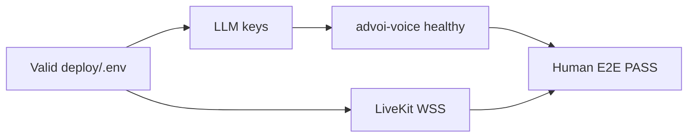

# Path to full working system

How close ADVoi is to a **complete, testable staging system** and what to do next.

**Last verified:** 2026-07-08  
**Commit:** `48e7645`  
**Staging:** `https://advoi.keyteller.com`  
**VPS:** `deploy@187.77.140.216` `/opt/advoi`

---

## Definition of "full working system"

A human can use ADVoi as a voice-first executive OS slice on staging — not a scaffold demo.

| Layer | Requirement | Today |
|-------|-------------|-------|
| Voice PWA (Path A) | Open PWA, connect voice, mic works, green status, greeting + frame TTS within ~10s | **Built** — human sign-off pending |
| 3 decision frames | Tap or speak intent → spoken summary (fleet, briefs, review) | **Built** |
| 3 background agents | Fleet-scout, brief-curator, review-queue tick and cache `last_run` | **Built** — 3/3 ready on staging |
| Review queue | Postgres queue, PWA list, Option C two-turn confirm | **Built** — device confirm test pending |
| Staging infra | Traefik, valid `.env`, LLM keys, all containers up | **Staging-ready** (verified 2026-07-08) |
| Automated gates | pytest, agents-smoke, voice-smoke | **Built** — 105 pytest pass |
| Human sign-off | Recorded mic → STT → LLM → TTS on real device | **Open** |

**Out of scope for "full working" on staging (P2+):** Letta memory, Guardian auto-recovery, Aether routing, React Flow dashboard, Path B iOS WebGPU, OTel traces, squad execution.

---

## System status snapshot (live)

Verified against staging on 2026-07-08:

```
GET /api/health          → 200, agents_ready: 3/3
GET /api/diagnostics/voice → ok: true, llm_key: true, livekit_url: true
VPS containers           → api, web, voice, livekit, 3 agents, postgres, redis, memory-bridge: Up
deploy/.env              → PROJECT_SLUG=advoi, STOREFRONT_HOST=advoi.keyteller.com, interval=15s
pytest (local)           → 105 passed
GitHub                   → ActArtech/advoi-system @ 48e7645
```

### Maturity labels

| Label | Meaning | ADVoi today |
|-------|---------|-------------|
| **Built** | Code exists, unit tests pass | Most of Stage 1.5 |
| **Staging-ready** | Works on VPS when env healthy | **Yes** (as of last repair) |
| **Validated** | Human or CI E2E sign-off | **No** — critical gap |
| **Vision** | Designed, not implemented | Letta, Guardian, Aether, dashboard |

**Overall:** Feature-complete for Build 1.5. The gap is **operational validation**, not missing core code.

---

## What we have (summary)

See [what-we-have.md](what-we-have.md) for full inventory. Highlights:

### Voice paths

| Path | Stack | Route | Status |
|------|-------|-------|--------|
| **A (primary)** | LiveKit + Pipecat + server STT/LLM/TTS | `/` PWA | Built, staging-ready |
| **B (optional)** | Browser Parakeet STT + Kokoro TTS + API | `/voice-local` | Built locally, not device-validated |

### API surface (14 routes)

Health, LiveKit token, session, frames, frame run, agents, prewarm, voice intent, voice respond, review queue, diagnostics (agents, voice, latency).

### Three specialists

| Agent | Frame | Speaks first |
|-------|-------|--------------|
| fleet-scout | `fleet_status` | "Checking the fleet bridge now." |
| brief-curator | `open_briefs` | "Pulling open briefs from portfolio memory." |
| review-queue | `queue_deep_review` | "I can queue a deep review. I'll need your confirmation first." |

### Memory stack

Hindsight bridge (HTTP), Postgres (briefs + review queue), Redis (agent cache + voice turns). Letta off by default.

### CI (`advoi-ci.yml`)

- `python` — full pytest
- `web` — Next.js production build
- `agents-smoke` — API up + frame run + review queue

---

## Gaps (prioritized)

See [gaps-and-blockers.md](gaps-and-blockers.md) for detail.

### P0 — Blocks "staging validated"

| # | Gap | Status | Unblock |
|---|-----|--------|---------|
| 1 | **Human E2E voice sign-off** | Open | Complete [E2E-SIGNOFF.md](../operations/E2E-SIGNOFF.md) on phone |
| 2 | **LLM keys durable across deploy** | Mitigated | Always run `sync-llm-keys-from-clapart.sh` before deploy |
| 3 | **Shelve pull** | Mitigated | Keep `ADVOI_SHELVE_PULL=false` |

### P1 — Functional depth (after sign-off)

| # | Gap | Status |
|---|-----|--------|
| 1 | LiveKit two-turn confirm on real device | Code wired, needs mic test |
| 2 | Path B client voice (Kokoro/Parakeet) | Scaffold, iOS WebGPU untested |
| 3 | Voice latency under 800ms perceived | Partial (`/api/diagnostics/latency`) |
| 4 | Memory bridge without Hermes | Mitigated (non-fatal mock + diagnostics) |

### P2 — Platform (later)

Port registry sync, Letta, OTel, Aether/Guardian/Squads, React Flow dashboard.

### Blocker chain



---

## Next actions (critical path)

Ordered by leverage. Do **1 through 5** before any P2 work.

| # | Action | Owner | Effort | Verify |
|---|--------|-------|--------|--------|
| 1 | **Human Path A E2E** on phone | Human | 15 min | [E2E-SIGNOFF.md](../operations/E2E-SIGNOFF.md) steps 3-7 |
| 2 | **Say "queue review" → "yes"** on staging | Human | 15 min | Item appears in PWA review list |
| 3 | **Run staging smoke from VPS** | Human/agent | 15 min | `ADVOI_BASE_URL=https://advoi.keyteller.com bash scripts/voice-smoke-test.sh` |
| 4 | **Record sign-off in DEV-LOG** | Human | 5 min | Date + device + PASS/FAIL |
| 5 | **Close STAGE.md exit criteria** | Agent | 15 min | Mark Traefik + E2E boxes done |
| 6 | Path B desktop spot-check (`/voice-local`) | Human | 1 hr | WebGPU loads, speak, hear reply |
| 7 | Sync port registry to vps-shared | Human | 1 hr | Row committed |
| 8 | Latency baseline capture | Agent | 2 hrs | Log `timings_ms` from diagnostics |
| 9 | Playwright smoke for PWA connect UI | Agent | 1 day | CI job, no mic |
| 10 | Letta enablement (Phase 4) | Agent | 3-5 days | Operational memory writes |

---

## Regression risks

| Risk | What breaks | Prevention |
|------|-------------|------------|
| Shelve pull re-enabled | Corrupt `.env`, Traefik 404, no audio | `ADVOI_SHELVE_PULL=false` always |
| Local template on VPS | Missing `STOREFRONT_HOST`, API 404 | `DEPLOY_MODE=staging` + `repair-vps-env.sh` |
| Keys lost on template restore | Voice crash-loop, green PWA, silence | `sync-llm-keys-from-clapart.sh` before `up` |
| Deploy without smoke | Broken staging unknown until user tests | Block deploy on voice-smoke + agents-smoke |
| Windows tar permissions | `next: Permission denied` on web build | Use `.dockerignore`, `npm ci` in Dockerfile.web |

---

## Quick commands

### Local

```powershell
cd D:\Down\livekit-agent\deployment\advoi\advoi-system
uv sync
.\scripts\start-api.ps1          # or run-agents-uv.ps1 for API + supervisor
.\scripts\agents-smoke-test.ps1
uv run pytest tests/ -q
```

### Staging (VPS)

```bash
ssh deploy@187.77.140.216
cd /opt/advoi
ADVOI_SHELVE_PULL=false DEPLOY_MODE=staging bash scripts/repair-vps-env.sh
ADVOI_BASE_URL=https://advoi.keyteller.com bash scripts/voice-smoke-test.sh
docker compose -f docker-compose.yml -f deploy/docker-compose.staging.yml \
  --env-file deploy/.env --profile app ps
```

### Staging (from laptop)

```powershell
curl https://advoi.keyteller.com/api/health
curl https://advoi.keyteller.com/api/diagnostics/voice
```

---

## Related docs

| Doc | Purpose |
|-----|---------|
| [what-we-have.md](what-we-have.md) | Full feature inventory |
| [gaps-and-blockers.md](gaps-and-blockers.md) | Blockers and mitigations |
| [improvement-roadmap.md](improvement-roadmap.md) | Phased build plan |
| [../operations/E2E-SIGNOFF.md](../operations/E2E-SIGNOFF.md) | Human voice test template |
| [../operations/staging-runbook.md](../operations/staging-runbook.md) | Deploy and ops |
| [../architecture/](../architecture/) | System design |