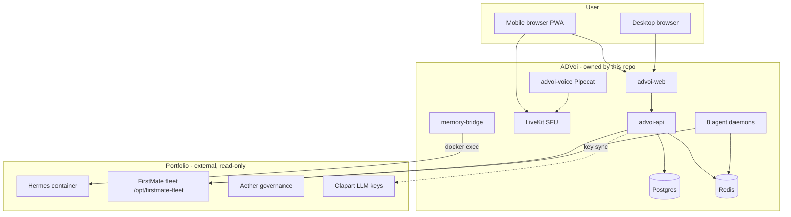
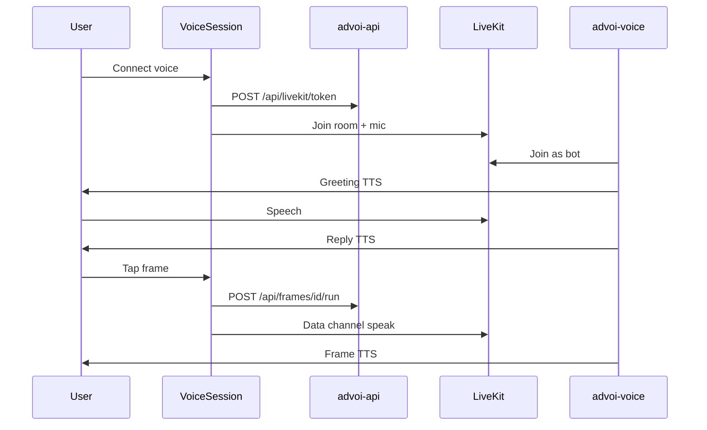

# ADVoi — External Engineering and Architecture Review

**Document type:** Independent review pack for senior engineers and architects  
**System:** ADVoi (voice-first executive operating layer)  
**Repository:** `ActArtech/advoi-system` (local: `deployment/advoi/advoi-system`)  
**Staging:** https://advoi.keyteller.com  
**Prepared:** 2026-07-08  
**Stage:** Build 1.5+ (voice + PWA + 8 specialist agents)  
**Review audience:** External advanced engineering, security, platform, and voice/ML architects

---

## 1. Purpose of this document

This pack enables an **external reviewer** to assess ADVoi without prior portfolio context. It covers:

- Problem statement and system boundaries
- Architecture (logical, runtime, deployment)
- Key decisions and trade-offs
- Implementation maturity (built vs stub vs vision)
- Security, reliability, and operational posture
- Test and CI evidence
- Known gaps, risks, and recommended review focus areas

**Authoritative live snapshot:** `docs/current-state/SYSTEM-STATUS.md`  
**Phased roadmap:** `docs/current-state/improvement-roadmap.md`  
**ADR index:** `docs/decision-log/DECISION-LOG.md` (ADR-001 through ADR-026)

---

## 2. Executive summary

### 2.1 What ADVoi is

ADVoi is a **voice-first personal executive OS** layered on an existing multi-project portfolio stack (Hermes reasoning/memory, FirstMate fleet coordination, Aether venture governance). It is **not** a replacement for those systems. It:

- Accepts voice (primary) and PWA UI (secondary) input
- Routes user intent to **decision frames** executed by **specialist agents**
- Speaks results via LiveKit/Pipecat or alternative client/server voice paths
- Reads portfolio state (fleet files, briefs, memory) in a **read-only** posture toward sibling systems
- Defers high-stakes actions behind a **confirmation harness**

### 2.2 Maturity assessment (reviewer lens)

| Dimension | Rating | Notes |
|-----------|--------|-------|
| **Architecture clarity** | Strong | Vertical/horizontal split, thin voice layer, explicit ADRs |
| **Code completeness (Build 1.5)** | High | 8 agents, 8 frames, 3 voice paths, 20+ API routes |
| **Automated quality gates** | Good | 140 pytest, CI (python + web + smoke), orchestrate CLI |
| **Staging operability** | Good | Traefik, compose, smoke scripts; env repair hardened |
| **Human validation** | Low | No recorded E2E sign-off on physical device |
| **Platform depth (Phase 4)** | Early | Guardian/Letta/Aether/squads mostly stub or partial |
| **Production readiness** | Pre-production | Suitable for staged pilot; not multi-tenant SaaS |

### 2.3 Reviewer verdict template

Use this checklist at end of review:

- [ ] Architecture supports stated vision without unacceptable coupling
- [ ] Voice path failure modes are understood and mitigated
- [ ] Security boundary with Hermes/docker.sock/fleet mounts is acceptable
- [ ] Confirmation harness adequate for consequential frames
- [ ] Memory write-target model (ADR-026) is sound
- [ ] Operational runbooks sufficient for on-call
- [ ] Technical debt documented and prioritized
- [ ] Path to production voice pilot is credible

---

## 3. System context and boundaries

### 3.1 Portfolio ecosystem (read-only integration)



### 3.2 In scope (this system owns)

| Capability | Owner module |
|------------|--------------|
| HTTP API and PWA | `advoi/api`, `web/` |
| LiveKit token minting | `advoi/voice/tokens.py` |
| Pipecat voice worker | `advoi/voice/agent.py` |
| Decision frame catalog | `advoi/decision/frames.py` |
| Specialist agent execution | `advoi/routing/frame_runner.py` |
| Intent classification (keyword) | `advoi/routing/intent.py` |
| Hybrid memory routing | `advoi/memory/` |
| Agent cache and daemons | `advoi/routing/agent_daemon.py`, `advoi/cache/` |
| Deploy and smoke automation | `scripts/`, `deploy/`, `.github/workflows/` |

### 3.3 Out of scope (explicitly external or stub)

| Capability | Status | Location |
|------------|--------|----------|
| Deep Hermes reasoning loops | External | `hermes` container |
| Fleet job execution / crew spawn | External | FirstMate |
| Venture portfolio routing | Stub | `advoi/aether/` |
| Squad autonomous execution | Stub | `advoi/squads/` |
| Document ingestion pipeline | Stub | `advoi/ingestion/` |
| Stakeholder reporting engine | Stub | `advoi/reporting/` |
| Full ontology governance engine | Stub | `advoi/ontology/` |
| React Flow architecture dashboard | Not started | PWA status only |

### 3.4 Design principles (locked)

1. **Thin voice layer** — Transport and turn pipeline only; intelligence in routing/memory/decision (ADR-004).
2. **Confirmation harness** — Consequential frames require explicit confirm (voice phrase or double-tap).
3. **Ontology-first (target)** — Named frames, agents, memory write targets; full ontology engine deferred.
4. **Production-oriented from day one** — Health checks, env-driven config, Docker, smoke scripts.

---

## 4. Logical architecture

### 4.1 Verticals and horizontals

| Layer | Module | Maturity |
|-------|--------|----------|
| **Voice vertical** | `advoi/voice/` | Built — Pipecat, LiveKit, respond, server TTS, memory hooks |
| **Decision vertical** | `advoi/decision/` | Built — 8 frames A through H |
| **Memory vertical** | `advoi/memory/` | Built — router, Hindsight bridge, Postgres, Redis, JSONL fallback |
| **Routing vertical** | `advoi/routing/` | Built — agents, frame runner, orchestrator, daemons, intent |
| **Guardian vertical** | `advoi/guardian/` | Partial — confirmation policy, recovery logging |
| **Aether vertical** | `advoi/aether/` | Stub |
| **Squads vertical** | `advoi/squads/` | Stub |
| **Observability horizontal** | `advoi/observability/` | Partial — request trace middleware; OTel collector profile only |
| **Ingestion horizontal** | `advoi/ingestion/` | Stub |
| **Reporting horizontal** | `advoi/reporting/` | Stub |

### 4.2 Decision frame model

Each **decision frame** is a bounded user-facing capability bound 1:1 to a **specialist agent**.

| Frame ID | Label | Agent | Confirmation |
|----------|-------|-------|--------------|
| `fleet_status` | Option A: Fleet status | fleet-scout | No |
| `open_briefs` | Option B: Open briefs | brief-curator | No |
| `queue_deep_review` | Option C: Queue deep review | review-queue | **Yes** |
| `systems_pulse` | Option D: Systems pulse | systems-pulse | No |
| `memory_health` | Option E: Memory health | memory-scout | No |
| `latency_check` | Option F: Latency check | latency-watch | No |
| `guardian_status` | Option G: Guardian status | guardian-sentinel | No |
| `deploy_readiness` | Option H: Deploy readiness | deploy-scout | No |

Source: `advoi/decision/frames.py`, `advoi/routing/agents.py`

### 4.3 Execution modes

| Mode | Entry | Use case |
|------|-------|----------|
| PWA frame button | `POST /api/frames/{id}/run` | Explicit user action |
| LiveKit data channel | `{type:"frame"}` or `{type:"speak"}` | In-room voice worker |
| Keyword intent | `POST /api/voice/intent` | Speech to frame mapping |
| Warm chat reply | `POST /api/voice/respond` | General conversation |
| Background daemon | `agent_daemon.py` per specialist | Redis cache warming |
| Local supervisor | `advoi-supervisor` | Dev: all agents one process |
| Parallel orchestration | `advoi-orchestrate`, `POST /api/agents/orchestrate` | CI, bulk refresh |

---

## 5. Voice architecture (three paths)

### 5.1 Path A — LiveKit + Pipecat (primary, staging)

**Route:** `/` (VoiceSession)  
**Stack:** Browser WebRTC to LiveKit SFU; `advoi-voice` runs Pipecat STT, LLM, TTS pipeline.



**Critical dependency:** `OPENAI_API_KEY` or `OPENROUTER_API_KEY`. Voice container **crash-loops** without LLM credentials.

**Known failure mode:** PWA shows connected (green) but **no audio** when `advoi-voice` is unhealthy. Frame API may still return text.

### 5.2 Path B — Client voice (privacy / latency)

**Route:** `/voice-local` (VoiceLoop `auto` mode)  
**Stack:** Parakeet STT + Kokoro TTS in browser (ONNX/WASM/WebGPU); LLM via API.

| Concern | Detail |
|---------|--------|
| Headers | COOP/COEP in `web/next.config.ts` for SharedArrayBuffer |
| Model load | HuggingFace CDN on first visit; large download |
| Windows | WASM fallback common; auto-fallback to server TTS |
| Intent | Uses `/api/voice/intent` then frame run or `/api/voice/respond` |

### 5.3 Path C — Server voice (no WebGPU)

**Route:** `/voice-server` (VoiceLoop `server` mode)  
**Stack:** Browser Speech API STT + `POST /api/voice/speak` (server MP3 TTS).

Suitable when client ONNX/WebGPU is unavailable.

---

## 6. Data and memory architecture (ADR-026)

### 6.1 Hybrid memory tiers

| Tier | Technology | Purpose |
|------|------------|---------|
| Strategic | Hindsight via Hermes docker exec | Portfolio facts, long-horizon recall |
| Operational | Letta (optional) or JSONL `operational_store` | Identity, prefs, milestones |
| Ephemeral | Redis rolling window | Voice turns, session context |
| Canonical | Postgres | `decision_briefs`, review queue, events |
| Agent cache | Redis `advoi:agent:{id}:last` | Fast PWA/voice frame responses |

### 6.2 Write targets (explicit routing)

`advoi/memory/write_targets.py` prevents double-write:

| Event type | Primary store |
|------------|---------------|
| `portfolio_fact` | Hindsight |
| `user_preference` | Letta (when enabled) |
| `voice_turn` | Redis |
| `runtime_error` | Guardian log |

### 6.3 Memory bridge security note

`advoi-memory-bridge` mounts **`/var/run/docker.sock`** to `docker exec` into the Hermes container. This is a **high-privilege** integration. Reviewers should assess:

- Container isolation on shared VPS
- Principle of least privilege alternatives (HTTP sidecar, gRPC bridge)
- Blast radius if API or bridge is compromised

---

## 7. Runtime and deployment topology

### 7.1 Docker Compose (profile `app`)

| Service | Role | Host port (typical) |
|---------|------|---------------------|
| `postgres` | Canonical DB | 5438 |
| `redis` | Cache + voice turns | 6382 |
| `advoi-api` | FastAPI | 8010 |
| `advoi-web` | Next.js PWA | 3000 |
| `livekit` | WebRTC SFU | 7880 |
| `advoi-voice` | Pipecat worker | 8011 |
| `advoi-memory-bridge` | Hindsight HTTP bridge | 8095 |
| `advoi-agent-*` (x8) | Background specialist daemons | internal |

VPS path: `/opt/advoi` (clone-only policy; does not overwrite sibling projects).

### 7.2 Staging traffic (Traefik)

| Host | Backend |
|------|---------|
| `advoi.keyteller.com` | `advoi-web` (priority 10), `advoi-api` `/api` (priority 50) |
| `livekit.advoi.keyteller.com` | `livekit` WebSocket |

### 7.3 Configuration model

| File | Purpose |
|------|---------|
| `deploy/.env.staging.example` | VPS template |
| `deploy/.env.local.example` | Local mock testing |
| `deploy/.env` | Active secrets (gitignored) |

**Port semantics (fixed):**

- Container API listens on **`ADVOI_API_LISTEN_PORT=8000`** (always)
- Host bind uses **`ADVOI_API_HOST_PORT`** (e.g. 8010)

**Secrets management:**

- Shelve pull **disabled by default** (`ADVOI_SHELVE_PULL=false`) due to historical `.env` corruption
- Deploy script auto-restores corrupt env from staging example
- Optional key sync: `scripts/sync-llm-keys-from-clapart.sh`

---

## 8. API surface (for reviewers)

| Method | Path | Purpose |
|--------|------|---------|
| GET | `/api/health` | Liveness + agent readiness summary |
| POST | `/api/livekit/token` | Mint LiveKit JWT |
| GET | `/api/session` | Room, frames, agents metadata |
| GET | `/api/frames` | Decision frame catalog |
| POST | `/api/frames/{id}/run` | Execute frame (`confirmed`, `refresh`) |
| GET | `/api/agents` | Registry + Redis `last_run` |
| POST | `/api/agents/prewarm` | Parallel cache fill |
| POST | `/api/agents/orchestrate` | Multi-frame parallel run |
| POST | `/api/agents/run-all` | All 8 frames |
| POST | `/api/voice/intent` | Transcript to frame or chat |
| POST | `/api/voice/respond` | Warm spoken LLM reply |
| POST | `/api/voice/speak` | Server TTS (MP3) |
| GET | `/api/review-queue` | Pending reviews |
| GET | `/api/diagnostics/voice` | Voice config probe |
| GET | `/api/diagnostics/agents` | Agent cache status |
| GET | `/api/diagnostics/memory` | Memory stack probe |
| GET | `/api/diagnostics/guardian` | Confirmation policy |
| GET | `/api/diagnostics/latency` | SLA timing probe |

**Cross-cutting:** `RequestTraceMiddleware` adds `x-request-id` and `x-response-time-ms`.

---

## 9. Key architectural decisions (ADR summary)

| ADR | Decision | Review implication |
|-----|----------|------------------|
| ADR-001 | Web PWA first, no native APK | Faster delivery; iOS mic/background limits |
| ADR-002 | LiveKit transport + Pipecat pipeline | Industry-standard split; two moving parts |
| ADR-003 | Keep Hermes + FirstMate | Integration complexity vs rebuild |
| ADR-004 | Thin voice layer | Good separation; routing must stay disciplined |
| ADR-012 | Decision frames + desktop deep analysis | Mobile defers high-stakes resolution |
| ADR-017 | Rule-based model routing | Simple; may need ML router at scale |
| ADR-025 | OpenRouter for model experiments | Vendor concentration risk |
| ADR-026 | Hindsight + optional Letta memory | Clear tiers; bridge is ops-sensitive |

Full text: `docs/decision-log/DECISION-LOG.md`

---

## 10. Security and safety posture

### 10.1 Authentication and authorization

| Area | Current state | Review note |
|------|---------------|-------------|
| API auth | **None** on staging (public HTTPS) | Acceptable for private pilot only |
| LiveKit tokens | Short-lived JWT, room-scoped | Standard pattern |
| Frame execution | No user identity binding | All users share session/memory ids |
| Fleet access | Read-only mount | Good boundary |
| Hermes bridge | docker.sock exec | **High risk** — justify or replace |

### 10.2 Confirmation harness

- Frame `queue_deep_review` requires `confirmed=true` or confirm phrase ("yes", "confirm", etc.)
- Policy exposed at `GET /api/diagnostics/guardian`
- Implementation: `advoi/guardian/confirmation.py`, PWA double-tap, voice two-turn flow

**Reviewer question:** Is one confirm phrase sufficient for production portfolio actions?

### 10.3 Data handling

- Voice audio: Path A streams to cloud STT; Path B processes locally
- LLM prompts may include memory recall chunks (strategic + ephemeral)
- No PII redaction layer documented
- Postgres and Redis on isolated compose network; host-bound to localhost on VPS

---

## 11. Reliability and observability

### 11.1 Health and smoke gates

| Gate | Command |
|------|---------|
| Unit tests | `uv run pytest tests/ -q` (140 tests) |
| Agent smoke | `scripts/agents-smoke-test.ps1` |
| Voice smoke | `scripts/voice-smoke-test.sh` |
| Orchestrate | `uv run advoi-orchestrate all --refresh` |
| Staging precheck | `scripts/staging-signoff-precheck.sh` |

### 11.2 CI (`.github/workflows/advoi-ci.yml`)

| Job | Validates |
|-----|-----------|
| `python` | Full pytest |
| `web` | Next.js production build |
| `agents-smoke` | API up + frame run + review queue |
| `staging-smoke` | Optional remote staging curl |

### 11.3 Observability gaps

| Capability | Status |
|------------|--------|
| Structured logging | Partial (structlog in places, loguru in voice) |
| Request tracing | HTTP headers only |
| OTel traces | Collector profile exists; app not instrumented |
| Agent alerting | Logs only; no PagerDuty/Discord hook |
| SLO dashboards | Diagnostics endpoints only |

---

## 12. Testing maturity

| Layer | Coverage | Gap |
|-------|----------|-----|
| API contracts | Strong (journey tests, intent, frames) | No contract tests vs OpenAPI |
| Frame runner | Mock + disk snapshot tests | Limited Postgres integration |
| Voice worker | Frame dispatch unit tests | No LiveKit E2E in CI |
| Frontend | Build gate only | No Playwright/component tests |
| Human E2E | Manual tracker | **Not recorded** |

Manual test matrix: `docs/operations/MANUAL-TEST-TRACKER.md`  
E2E template: `docs/operations/E2E-SIGNOFF.md`

---

## 13. Known gaps and technical debt

### 13.1 P0 (validation, not blocking development)

- [ ] Human Path A E2E on physical device (mic to TTS heard)
- [ ] LiveKit two-turn confirm on device ("queue review" then "yes")
- [ ] VPS redeploy to run all 8 agent containers (staging may lag code)
- [ ] Port registry sync to `ActArtech/vps-shared`

### 13.2 P1 (functional depth)

- [ ] Full end-to-end latency budget (mic-STT-LLM-TTS) under 800ms perceived
- [ ] Path B iOS WebGPU validation
- [ ] Per-user session isolation and auth

### 13.3 P2 (platform backlog)

- [ ] Letta operational memory (ADR-026 phase 2)
- [ ] Guardian auto-recovery and notifications
- [ ] Aether venture routing
- [ ] Squad execution via FirstMate triggers
- [ ] React Flow dashboard
- [ ] Ingestion and reporting horizontals
- [ ] PWA service worker / offline install

### 13.3 Stale documentation (reviewer beware)

Some files under `docs/architecture/` predate Build 1.5+ (reference 3 agents). **Trust order:**

1. `docs/current-state/SYSTEM-STATUS.md`
2. `docs/reviews/EXTERNAL-ENGINEERING-ARCHITECTURE-REVIEW.md` (this file)
3. `docs/current-state/what-we-have.md`
4. `.aether/STAGE.md`
5. `docs/architecture/*` (may lag)

---

## 14. Risks register (for external review)

| ID | Risk | Likelihood | Impact | Mitigation today |
|----|------|------------|--------|------------------|
| R1 | `advoi-voice` down, PWA shows connected | Medium | High | Diagnostics + smoke; no client-side bot health |
| R2 | LLM key loss on deploy | Medium | High | `sync-llm-keys-from-clapart.sh`, corrupt env repair |
| R3 | Shelve corrupts `.env` | Low | High | `ADVOI_SHELVE_PULL=false` |
| R4 | docker.sock bridge compromise | Low | Critical | Isolate bridge container; review alternatives |
| R5 | Keyword intent misroutes speech | Medium | Medium | Confirm harness on risky frames; intent tests |
| R6 | Memory recall stale/wrong | Medium | Medium | Write targets; graceful fallback |
| R7 | Windows dev env drift | High | Low | `.ps1` scripts, WASM fallback |
| R8 | No API auth on public staging | High | High | Accept pilot-only; add auth before broader exposure |

---

## 15. Recommended review focus areas

### 15.1 Architecture

1. Is the **thin voice layer** holding as agents and frames grow (now 8)?
2. Should **intent routing** remain keyword-based or move to classifier/LLM router?
3. Is **1:1 frame-to-agent** scaling, or should frames compose sub-workflows?
4. Is the **memory bridge** pattern acceptable for production?

### 15.2 Voice / realtime

1. LiveKit + Pipecat coupling: failure domains and scaling limits
2. Three voice paths: operational complexity vs user benefit
3. Turn-taking, barge-in, interruption handling maturity
4. Latency SLO feasibility on 16GB VPS + cloud LLM

### 15.3 Security

1. Staging exposure without API auth
2. docker.sock and fleet mount blast radius
3. Confirmation harness sufficiency for portfolio actions
4. Secret lifecycle (Shelve, clapart sync, manual `.env`)

### 15.4 Operations

1. 8 agent daemons + voice + API: resource footprint on VPS
2. Deploy idempotency and rollback story
3. Observability gap before production pilot
4. CI vs staging parity (mock frames vs real fleet)

---

## 16. Evidence pack (what to run locally)

```powershell
cd deployment/advoi/advoi-system

# Dependencies
uv sync --group dev

# Full unit suite
uv run pytest tests/ -q

# One-shot 8-agent orchestration
uv run advoi-orchestrate all --refresh

# API + supervisor + smoke
.\scripts\run-multi-agent-stack.ps1

# Voice journey (requires API on 8010)
.\scripts\agents-smoke-test.ps1
```

```bash
# Staging smoke (from laptop)
ADVOI_BASE_URL=https://advoi.keyteller.com bash scripts/voice-smoke-test.sh
curl -s https://advoi.keyteller.com/api/diagnostics/voice | jq .
```

---

## 17. Stage checklist (what is done)

### Build 0 through 1.5

| Stage | Deliverable | Status |
|-------|-------------|--------|
| 0 | Vision, ADRs, clarity framework | Done |
| 1.0 | Python package, VPS clone, memory scaffold | Done |
| 1.1 | LiveKit + Pipecat + PWA connect | Done |
| 1.5 | 8 frames/agents, intent, 3 voice paths, review queue | Done |
| 1.5+ | Orchestrate CLI, server TTS, guardian confirm, trace middleware | Done |
| 2.x | Human E2E sign-off, port registry | **Open** |
| 4.x | Letta, full Guardian, Aether, squads, dashboard | Partial / stub |

### Phase roadmap (from improvement-roadmap.md)

| Phase | Theme | Status |
|-------|-------|--------|
| 1 | Stabilize staging | Complete |
| 2 | Multi-agent depth | Complete (8 agents) |
| 3 | Voice quality (3 paths, intent, warmth) | Complete (latency E2E partial) |
| 4 | Platform (Letta, Guardian, Aether, OTel) | Started |

---

## 18. Related documents

| Document | Path |
|----------|------|
| System status snapshot | `docs/current-state/SYSTEM-STATUS.md` |
| Feature inventory | `docs/current-state/what-we-have.md` |
| Gaps and blockers | `docs/current-state/gaps-and-blockers.md` |
| Improvement roadmap | `docs/current-state/improvement-roadmap.md` |
| Path to full system | `docs/current-state/path-to-full-system.md` |
| Stage governance | `.aether/STAGE.md` |
| Clarity framework | `docs/CLARITY-FRAMEWORK.md` |
| Decision log | `docs/decision-log/DECISION-LOG.md` |
| Architecture diagrams | `docs/architecture/` |
| Staging runbook | `docs/operations/staging-runbook.md` |
| Manual test tracker | `docs/operations/MANUAL-TEST-TRACKER.md` |
| Memory operator guide | `docs/MEMORY-STACK.md` |
| VPS setup | `docs/VPS-SETUP.md` |

---

## 19. Document control

| Field | Value |
|-------|-------|
| Version | 1.0 |
| Maintainer | ADVoi engineering |
| Next review | After human E2E sign-off or Phase 4.1 Letta land |
| Change trigger | New agent/frame, auth layer, or production pilot scope |

**Reviewer feedback:** Open issues against `ActArtech/advoi-system` or append findings to `docs/reviews/REVIEW-FINDINGS.md` (create on first external review cycle).

---

*This document is intended for external advanced engineering and architecture review. It reflects codebase state as of 2026-07-08 with 8 specialist agents, 8 decision frames, 3 voice paths, and 140 automated tests.*