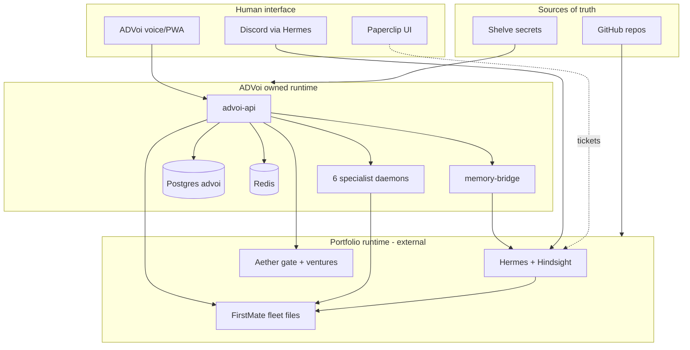

# Portfolio system moat — holistic architecture view

**Audience:** Product, architecture, and engineering leads  
**Date:** 2026-07-10  
**Baseline:** `advoi-system` @ `5d50805`, staging 6/6 agents  
**Companion docs:** [SYSTEM-FRAMEWORK.md](../../../SYSTEM-FRAMEWORK.md) (portfolio layers) | [PORTFOLIO-INTEGRATION.md](../PORTFOLIO-INTEGRATION.md) | [ROADMAP-VALIDATION.md](../operations/ROADMAP-VALIDATION.md)

---

## 1. Executive thesis

ADVoi is often described as a **voice layer**. That framing understates the product and overstates commodity risk.

**Commodity (not the moat):** LiveKit transport, Pipecat pipelines, OpenRouter LLM calls, generic agent frameworks, even "six specialist daemons" as a pattern.

**Moat (compound across modules):** A **portfolio control plane** that ties together:

1. **Governed attention** — ontology-backed frames, venture routing, and confirmation harness for consequential actions
2. **Proprietary operational memory** — write-target routing (what goes to Hindsight vs Postgres vs Letta vs fleet files vs guardian log)
3. **Closed execution loops** — ingest → triage → route → approve → FirstMate → Discord ACK → voice readback
4. **Portfolio-specific learning** — squad lessons, gate verdicts, appetite/capacity signals from Aether, not generic chat memory
5. **Single-VPS operating rhythm** — one human interface (voice + PWA) over 30+ slugs without re-learning each project's CLI

The winning move is not "better voice." It is **making the Keyteller portfolio operable as one system** while competitors still ship isolated chatbots per app.

---

## 2. Ecosystem map

ADVoi sits at the **human interface + orchestration edge** of a five-layer portfolio (from SYSTEM-FRAMEWORK):

```text
Layer 1  Human interface     Discord (Hermes) | Paperclip UI | ADVoi voice/PWA  ← ADVoi owns this wedge
Layer 2  Orchestration       Paperclip tickets, 18 agents, heartbeats
Layer 2.5 Governance        Aether principles, .aether/ per venture, shaped bets
Layer 3  Runtime              Hermes (LLM, tools, Hindsight, Discord gateway)
Layer 4  Code truth          GitHub → VPS /opt/<slug>
Layer 5  Secrets             Shelve → deploy/.env (runtime cache)
```

**Sibling systems ADVoi integrates with (read-mostly today):**

| System | VPS path | Role | ADVoi touchpoint |
|--------|----------|------|------------------|
| Hermes | container `hermes` | Interactive AI, Hindsight, Discord | memory-bridge, fm-hermes-trigger |
| FirstMate fleet | `/opt/firstmate-fleet` | Captain + crew, backlog, Discord bridge | `fm-bridge.sh`, fleet frames, ingestion dispatch |
| Aether | `/opt/aether` | Principles, venture bets | gate snapshot, portfolio.json, frame enrichment |
| Clapart | `/opt/clapart` | Voice patterns, LLM key source | key sync script, fleet active project |
| Paperclip | hosted | Tickets, approvals, agent budgets | indirect via fleet/Hermes (not wired to ADVoi API yet) |
| Shelve | hosted | Secret canonical store | deploy/.env materialization (fragile for ADVoi) |
| vps-shared | `/opt/shared` | Port registry, cross-project notes | planned, not integrated |



---

## 3. Connection matrix

Who **reads**, **writes**, and **triggers** whom. This is where coupling and moat compound or fracture.

| From → To | Mechanism | Direction | Shared artifact | Risk if ignored |
|-----------|-----------|-----------|-----------------|-----------------|
| PWA → API | HTTPS `/api/*` | Read/write ADVoi | Redis session, Postgres | Stale web image vs API |
| Voice → API | LiveKit + frame/intent POST | Read/write ADVoi | `pending_operator` in Redis | Two-turn confirm lost on redeploy |
| API → Fleet | `bash fm-bridge.sh` → `fm-hermes-trigger.sh` | Write (side effects) | Fleet queue, Discord | No idempotency key; duplicate dispatch |
| API → Hermes | memory-bridge HTTP → docker exec | Read/write Hindsight | `advoi-portfolio` bank | Bridge single point; Hermes down = recall gap |
| Agents → Fleet | Read files under `FIRSTMATE_FLEET_PATH` | Read-only | `backlog.md`, crew folders | Fleet state not in git; ADVoi reads stale snapshot |
| API → Aether | `portfolio.json`, `aether-gate-latest.md` | Read | Gate verdict, venture map | Gate file VPS-only; no GitHub audit trail |
| Ingestion → Aether → Fleet | route → Guardian → fm-bridge | Write chain | Ingest inbox JSON/files | Auto-dispatch bypasses human triage (Phase 2 fix) |
| Squads → Fleet | Mock webhook / future live | Write | Squad job registry | Mock hides integration failures until production |
| Deploy → Shelve | `shelve pull` in vps-deploy | Write `.env` | `deploy/.env` | Corrupt env (char-split) breaks voice container |
| Clapart → ADVoi | `sync-llm-keys-from-clapart.sh` | Write secrets | OPENAI key in deploy/.env | Key drift if sync not in deploy pipeline |
| Paperclip → Hermes | `docker exec hermes` | Write code/deploy | GitHub + VPS slugs | ADVoi not in ticket loop; voice is parallel channel |
| Aether cron → venture | weekly sync | Write `.aether/` | Shaped bet, stage | Active venture is gem-dev-shop; fleet runs clapart |

**Pattern:** ADVoi is a **hub** that reads many filesystems and one container bridge, but does not yet own a **canonical portfolio event log**. That gap is the main structural weakness.

---

## 4. Shared state inventory

Multiple truths exist. Moat requires knowing which is authoritative for each decision type.

| State | Canonical store | Consumers | Freshness | Problem |
|-------|-----------------|-----------|-----------|---------|
| Code | GitHub `main` | All VPS slugs | On `git pull` | Fleet runtime data not in git |
| App secrets | Shelve | `deploy/.env` | On deploy | ADVoi disables Shelve pull by default (good); manual sync |
| Voice turns | Redis rolling window | Voice agent, intent | Session | Ephemeral by design |
| Decision briefs | Postgres + Redis cache + Hindsight | Brief curator | Daemon interval | Triple path merge complexity |
| Review queue | Postgres | Review frame, PWA | On write | Human confirm path |
| Fleet backlog | `/opt/firstmate-fleet/data/*` | Fleet scout, fm-bridge | Captain runtime | Not versioned; ops-branch-cleanup VPS-only |
| Aether gate | `aether-gate-latest.md` on fleet tree | Aether service, frames | Cron/manual | Not in advoi-system repo |
| Venture portfolio | `data/aether/portfolio.json` | Routing, ingestion | Git in advoi-system | Partial; builtin fallback masks missing file |
| Ingestion inbox | Local files under ingestion store | `/ingest` UI | Per upload | No cross-system id linking to Paperclip ticket |
| Guardian events | JSONL log | Diagnostics | Append | Not correlated with OTel trace IDs yet |
| Agent warmth | Redis `last_run` | PWA chips, diagnostics | 15s staging interval | Cache cleared on stop_agents |
| Operator pending | Redis via voice respond | Two-turn confirm | TTL implicit | Must survive only one session |

**Holistic rule:** Every new feature must declare **one write target** (per ADR-026) and **one read path**. Duplicating fleet backlog into Hindsight, for example, would erode moat by blurring belief vs operational queue.

---

## 5. Canonical interaction patterns

These are the **end-to-end journeys** the product must optimize as wholes, not as isolated API endpoints.

### Pattern A — Attention loop (read-only executive)

```text
User speaks/taps → intent classifier → frame runner (6 parallel) → spoken_summary
                 → optional Aether context enrich → memory retain (typed event)
```

**Modules involved:** voice, routing, decision, aether, memory, copy_style  
**Moat value:** Sub-10s portfolio pulse without opening Discord, Paperclip, or 6 repos  
**Gap:** Human E2E not recorded; Path B/C device matrix incomplete

### Pattern B — Consequential action loop (Guardian-gated)

```text
User intent (queue review | wake firstmate | start development)
  → Guardian evaluate (confirmed=false) → pending_operator + prompt
  → second turn "yes" / confirm phrase
  → Guardian proceed → frame run OR fm-bridge exec
  → fleet side effect → Discord/Hermes → future voice readback
```

**Modules involved:** guardian, voice/respond, fleet/trigger, session Redis, fm-bridge  
**Moat value:** Trust layer for mobile executive actions; competitors skip this  
**Gap:** Fleet confirm on physical device not signed off; no idempotency token on bridge

### Pattern C — Ingestion-to-execution loop (MVP → Phase 2)

```text
Upload file → extract_text → route_document (Aether venture + fleet slug)
  → inbox item → [Phase 2: triage → approve] → dispatch_item_dev
  → Guardian → fm-bridge → FirstMate captain
```

**Modules involved:** ingestion, aether, guardian, fleet  
**Moat value:** Closes "I have a doc on my phone → work happens on VPS" without manual Discord  
**Gap:** Phase 2 triage/approve not built; auto-dispatch on upload is too aggressive for production

### Pattern D — Multi-agent operations loop

```text
run-six (CLI | API | voice | PWA | dashboard) → 6 frames parallel
  → optional dispatch_squads → squad registry → mock/live webhook
  → platform diagnostics (run_six_ms, memory mode) → operational retain
```

**Modules involved:** routing/orchestrator, squads, observability, memory operational_bridge  
**Moat value:** Single control verb across surfaces; operational learning substrate  
**Gap:** Live squad webhooks; Letta/OTel not enabled on VPS

### Pattern E — Portfolio governance loop (Aether + Paperclip, partial)

```text
Aether weekly sync → venture .aether/ → gate verdict file on fleet
  → ADVoi reads gate → frames/skills respect appetite
  → [target] Paperclip ticket on violation or promote decision
```

**Modules involved:** aether (external), fleet files, advoi aether module  
**Moat value:** Bets and capacity inform voice, not just static prompts  
**Gap:** Active venture (gem-dev-shop) ≠ fleet active project (clapart); no Paperclip API bridge

### Pattern F — Daily human loop (SYSTEM-FRAMEWORK)

```text
CEO digest (Paperclip) + Comm Specialist (Discord) + [missing: ADVoi morning pulse]
```

**Moat opportunity:** ADVoi becomes the **third leg** of the daily loop: 60-second voice pulse replaces reading 18 agent streams  
**Gap:** Not positioned in ops docs as part of daily rhythm

---

## 6. Why piecemeal fixes fail

Recent sprint velocity (voice operators, Guardian, ingestion MVP, 6 agents) succeeded because each feature reused **orchestrator + Guardian + fm-bridge**. Failures cluster where boundaries are implicit:

| Symptom | Root cause (systemic) | Piecemeal fix (insufficient) | Holistic fix |
|---------|----------------------|------------------------------|--------------|
| Staging 3 frames vs 6 | Deploy/docs drift, no single parity gate | Redeploy once | Tier T2 gate in ROADMAP-VALIDATION + image tag in diagnostics |
| "What can you do" vague LLM | Intent router bypassed | One more prompt | Operator catalog as first-class registry shared by voice, API, PWA |
| Fleet state invisible on GitHub | Runtime data outside git | Copy brief.md manually | Fleet **event export** to Postgres or JSONL with venture id |
| Shelve corrupts .env | Two canonical secret paths | Disable Shelve pull | Portfolio secret profile: Hermes keys vs app keys vs ADVoi-local |
| Aether vs fleet project mismatch | No single "active execution target" | Document clapart | **Execution context** object: `{venture, fleet_slug, github_repo, paperclip_project}` |
| Ingestion auto-dispatch risk | Upload conflated with approve | Add checkbox | Phase 2 lifecycle states as state machine |
| Mock squads pass CI | Test doubles hide webhook contract | Flip env flag | Contract tests against FirstMate webhook schema + Discord ACK parser |
| Architecture docs say 3 agents | Ontology/docs not in CI | Edit one file | Generated manifest from `agents` registry + frame catalog |

**Lesson:** Treat every feature as a **state transition** in a portfolio state machine, not a new endpoint.

---

## 7. Moat architecture — what to compound

### 7.1 The control plane primitive

Introduce a single internal concept (name flexible: `PortfolioEvent`, `ExecutiveSignal`):

```text
PortfolioEvent {
  id, timestamp, venture_id, source (voice|ingest|fleet|paperclip|aether),
  type (attention|decision|dispatch|memory|gate),
  payload, guardian_status, execution_ref, trace_id
}
```

| Module | Uses PortfolioEvent for |
|--------|-------------------------|
| voice | retain after every intent/frame |
| ingestion | state transitions uploaded→dispatched |
| guardian | append gate decisions |
| fleet | mirror bridge invocations (read-back) |
| aether | attach gate verdict changes |
| observability | OTel span links |
| reporting | BI layer later |

**Moat:** Competitors can copy voice UI; they cannot copy **years of typed portfolio events** tied to your ventures, bets, and outcomes.

### 7.2 Ontology as enforcement, not documentation

`advoi/ontology/` is stubbed; CLARITY-FRAMEWORK defines the stack. Moat requires:

- Frame ids, agent ids, venture ids, squad ids as **validated vocabulary**
- Ingestion routes only to registered `venture_id`
- Guardian prompts reference ontology labels, not free text
- API rejects unknown frame/agent with structured errors (machine-readable)

### 7.3 Memory write targets as product policy

ADR-026 is already the right abstraction. Extend it to **user-visible policy**:

| User question | Answer comes from | Never from |
|---------------|-------------------|------------|
| What is fleet doing? | Fleet files + last bridge event | Hindsight beliefs |
| What did we decide? | Postgres briefs + Hindsight | Redis voice turns |
| What failed? | Guardian log | Letta identity memory |
| What did I prefer? | Letta (when enabled) | Fleet backlog |

### 7.4 Confirmation harness as brand

Guardian is not a feature flag. It is the **trust brand** for mobile executive OS:

- All write paths to fleet share `evaluate_fleet_confirmation`
- All ingestion dispatch uses same gate
- Paperclip approvals (future) map to same `pending_operator` pattern
- Voice, PWA, and `/ingest` show identical confirm copy

### 7.5 Execution context registry

One JSON/YAML registry (extend `portfolio.json` or vps-shared):

```yaml
ventures:
  clapart:
    github: ActArtech/clapart
    vps_path: /opt/clapart
    fleet_slug: clapart
    paperclip_project: clapart
    primary_frames: [fleet_status, open_briefs]
    aether_active: false
```

ADVoi, ingestion, Aether, and fleet bridge all resolve slugs through this file. **Eliminates gem-dev-shop vs clapart schizophrenia.**

---

## 8. Holistic recommendations

Prioritized by **cross-module leverage**, not ease of implementation.

### R1 — Portfolio Event Log (PEL) — foundation

**What:** Append-only `portfolio_events` table in ADVoi Postgres + optional nightly export to Hindsight as synthesis, not per-event double-write.

**Touches:** voice, ingestion, guardian, fleet trigger, squads, diagnostics  
**Moat:** Becomes the audit trail and learning dataset for the whole VPS  
**Validation:** T0 contract tests; every bridge invoke creates an event row

### R2 — Execution Context Registry (ECR)

**What:** Single `data/portfolio/execution-context.yaml` synced from vps-shared; replaces scattered env vars and builtin venture fallbacks.

**Touches:** aether, ingestion route, fleet frames, fm-bridge messages  
**Moat:** Correct routing is hard; central registry is operational IP  
**Validation:** T2 curl `/api/aether/status` shows resolved active execution target

### R3 — Complete Pattern B on device, then advertise it

**What:** Finish M2 human E2E; publish Guardian flow as product demo path.

**Touches:** voice, PWA, guardian, fleet  
**Moat:** Demonstrable trust on mobile; few voice products gate fleet writes  
**Validation:** T3 E2E-SIGNOFF + screen recording for portfolio onboarding

### R4 — Ingestion Phase 2 as state machine, not new screens

**What:** Implement triage → approve → dispatch as explicit transitions on `IngestItem.status`, reusing review-queue UX patterns and Guardian.

**Touches:** ingestion, aether, guardian, fleet, web `/ingest`  
**Moat:** Closes document-to-work loop with governance  
**Validation:** T0 lifecycle tests; T3 voice "approve ingestion item {id}"

### R5 — Fleet read/write symmetry

**What:** After every fm-bridge write, parse trigger output into PEL; fleet scout reads PEL + files for "last action" not just backlog text.

**Touches:** fleet, voice fleet_status, Discord loop  
**Moat:** Voice answers "what did I just trigger?" without opening Discord  
**Validation:** T2 intent "fleet status" includes `last_dispatch_at` from PEL

### R6 — Enable Letta + OTel as observability of moat

**What:** `LETTA_ENABLED=true` and `OTEL_ENABLED=true` on staging; link `trace_id` to guardian JSONL.

**Touches:** memory, observability, guardian, platform diagnostics  
**Moat:** Operational learning and traceability for compounding improvement  
**Validation:** T2 `/api/diagnostics/platform` shows letta_mode and otel_ready

### R7 — Live squad webhooks with ACK contract

**What:** `ADVOI_SQUAD_MOCK=false`; define webhook payload + expected Discord ACK states (ACK / PROMOTE / NEXT).

**Touches:** squads, fleet, Hermes Discord  
**Moat:** Voice dispatch becomes closed loop with crew feedback  
**Validation:** T2 integration test against staging webhook; fleet read includes crew status

### R8 — Paperclip bridge (read-first)

**What:** Read open tickets for active venture into `systems_pulse` frame; later, create ticket from ingestion approve.

**Touches:** routing frames, aether ECR, PEL  
**Moat:** ADVoi unifies Discord + Paperclip + voice into one pulse  
**Validation:** T2 systems_pulse mentions ticket count for clapart

### R9 — Docs and manifest generation from code

**What:** CI job emits `agents.json` + `frames.json` into docs; architecture 03/05 consume generated files.

**Touches:** docs, CI, ontology  
**Moat:** Lowers drift tax; external reviewers trust generated manifests  
**Validation:** T0 fail CI if doc manifest stale vs registry

### R10 — Position ADVoi in daily loop

**What:** Update OPERATIONS-GUIDANCE / SYSTEM-FRAMEWORK daily loop row: "ADVoi morning pulse (60s)" alongside Discord digest.

**Touches:** portfolio ops culture, not just code  
**Moat:** Habit formation is defensibility; unused voice layer has no moat

---

## 9. Anti-patterns (do not do)

| Anti-pattern | Why it erodes moat |
|--------------|-------------------|
| More LLM fallback for operator intents | Bypasses harness; trains users not to trust gates |
| Store fleet backlog in Hindsight | Blurs belief vs queue; corrupts recall |
| Per-project voice integrations | Replicates 30 silos; defeats portfolio thesis |
| Shelve pull on every ADVoi deploy without validation | Recurring voice crash-loop (BUG-002 class) |
| Auto-dispatch ingestion without approve | Violates mobile-first "prepare on desktop" promise |
| Building React Flow before PEL/ECR | Pretty graph of wrong or stale connections |
| Competing with Hermes Discord chat | ADVoi should **summarize and trigger**, not replace conversational depth |

---

## 10. 90-day compound path

Aligns with [ROADMAP-VALIDATION.md](../operations/ROADMAP-VALIDATION.md) but ordered for **system compounding**:

```text
Week 1-2   R3 Human E2E + R2 ECR stub (clapart + advoi + gem-dev-shop entries)
Week 3-4   R1 PEL schema + fleet bridge writes; R6 Letta/OTel on staging
Week 5-6   R4 Ingestion Phase 2 state machine; R5 fleet read symmetry
Week 7-8   R7 live squad webhooks + ACK parser
Week 9-10  R8 Paperclip read bridge into systems_pulse
Week 11-12 R9 manifest CI + R10 daily loop ops doc
```

**Exit criteria for "moat v1":**

- [ ] Any consequential action has PEL row + Guardian record + trace_id
- [ ] All routes resolve through ECR (no hardcoded clapart paths)
- [ ] Human E2E sign-off on Path A or C
- [ ] Ingestion cannot dispatch without approve state
- [ ] systems_pulse merges fleet + tickets + gate verdict in one spoken summary

---

## 11. Summary table — connections at a glance

| Layer | ADVoi module | Upstream | Downstream | Moat contribution |
|-------|--------------|----------|------------|-------------------|
| Voice | `voice/`, `web/` | User mic/browser | API, LiveKit | Habit + attention |
| Intent | `routing/intent` | Transcript | Frames, operators | Governed routing |
| Frames | `decision/`, `routing/` | Intent/tap | Agents, LLM | Executive vocabulary |
| Guardian | `guardian/` | All write paths | Block/proceed | Trust brand |
| Fleet | `fleet/` | Guardian | fm-bridge, files | Execution |
| Memory | `memory/` | All modules | Hindsight, PG, Redis, Letta | Typed recall |
| Aether | `aether/` | Gate, portfolio.json | Frame enrich, ingest route | Bet alignment |
| Ingestion | `ingestion/` | Upload/voice | Route, fleet | Work intake |
| Squads | `squads/` | run-six | Webhooks | Parallel capacity |
| Observability | `observability/` | Middleware | OTel, diagnostics | Compounding visibility |

---

## 12. One sentence product north star

**ADVoi wins when a founder can run the entire Keyteller portfolio from a 60-second voice pulse — with governed memory, confirmed execution, and a permanent event trail — without learning 30 repos, three UIs, and a fleet shell.**

That is the moat. Voice is the microphone. The control plane is the product.

---

## Changelog

| Date | Change |
|------|--------|
| 2026-07-10 | Initial holistic system view: ecosystem map, connection matrix, shared state, interaction patterns, moat architecture, 10 cross-module recommendations |